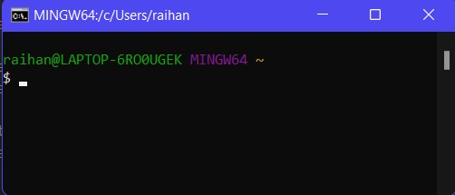
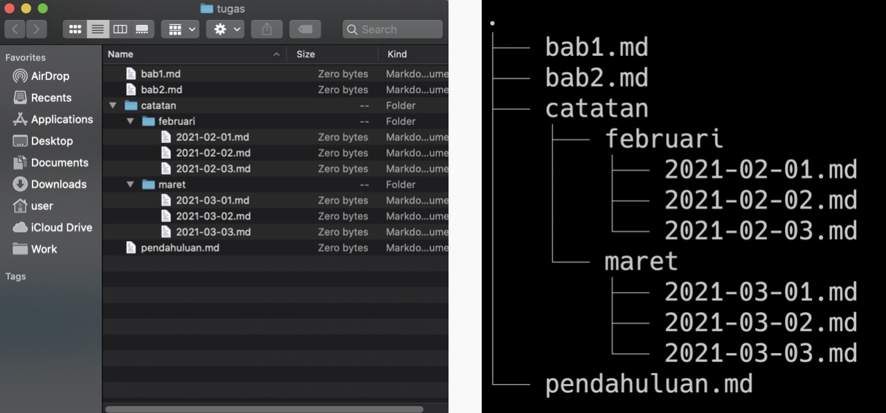
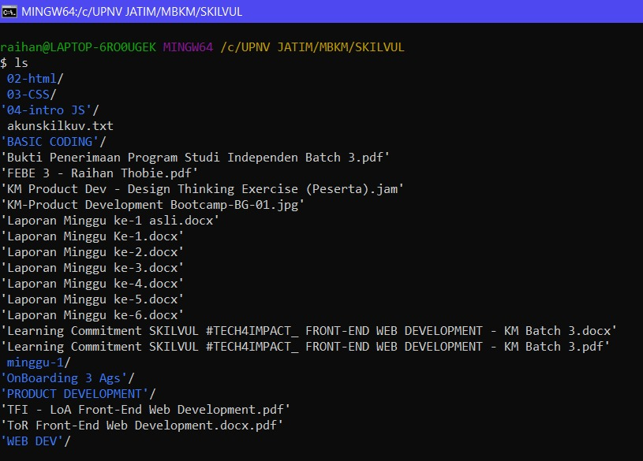
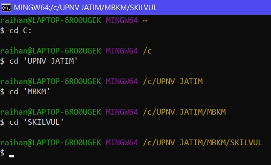
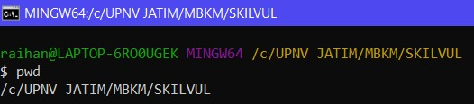
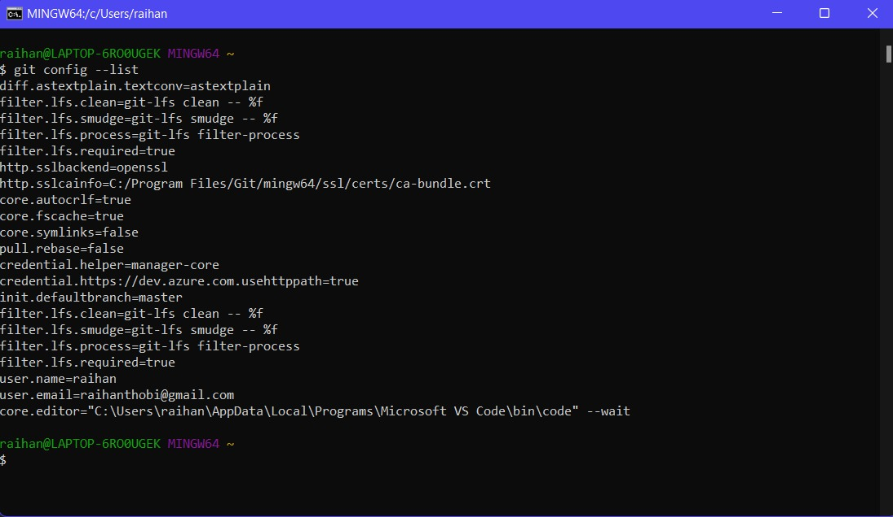
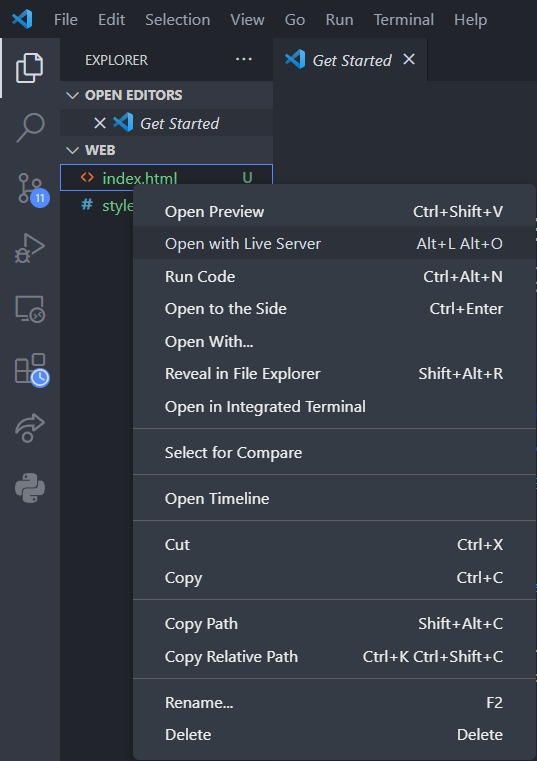
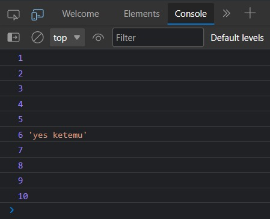

# Writing & Presentation Week-1

## Unix Command Line
pada CLI kita bisa mengetikan baris perintah dalam bentuk teks untuk memberikan intruksi kepada komputer untuk melakukan tugas tertentu.

- shell merupakan User Interface yang bertugas untuk memproses semua perintah yang diketik di CLI (dalam terminal).

- Shell membaca dan mengartikan perintah, lalu menginstruksikan sistem operasi untuk menjalankan task sesuai permintaan.

- Dengan kata lain, shell merupakan user interface yang mengelola CLI dan berperan sebagai perantara yang menghubungkan user dan sistem operasi.

> pada windows Shell default nya adalah **CMD / Command Prompt.**

pada gambar dibawah ialah contoh UI dari CLI (shell)


### cara mengakses CLI
 kalian bisa temukan dengan klik logo windows pada layar lalu cari program Command Prompt, atau cara lainnya tekan win + R dan ketik **cmd** pada program run sehingga akan langsung dapat mengakses Command Prompt secara cepat.
<hr>

## FILESYSTEM
untuk mengatur bagaimana data disimpan di dalam sebuah system.

direktori pada filesystem menggunakan struktur yang berbentuk seperti *tree* yang mana pada windows dapat terdiri dari beberapa *tree*

contoh tampilan struktur dari filesystem.


command untuk Navigasi:
- *ls (list)*
command untuk melihat **isi file** yang ada di sebuah directory


command untuk File Manipulation:
- *touch*
command untuk **membuat** sebuah file
    > `touch nama_file`
- *cp (copy)* | *cp -R*
command untuk **menyalin** suatu file dalam suatu directory | untuk **menyalin** directory
    > `cp nama_file | cp -R nama_directory`
- *mv* | *mv -R*
command untuk **memindahkan** file ke directory yang berbeda dan
**mengubah** nama file. | untuk **memindahkan** directory
    > `mv nama_file | mv -R nama_directory`
- *rm* | *rm -R / rm -d*
command untuk **menghapus** suatu file | maupun directory.
    > `rm nama_file | rm -R/-d nama_directory`


command untuk Folder Manipulation:
- *mkdir (make directory)*
command untuk **membuat** sebuah hingga beberapa directory sekaligus

    ```markdown
    mkdir [option] directory_name or path
    ```

- *cd (change directory)*
command untuk **berpindah** directory


- *pwd (Print Working Directory)*
command untuk melihat **current working directory** atau directory kita saat ini


command untuk melihat isi file:
- *head* command untuk melihat beberapa **baris awal** dari suatu file text
- *cat* command untuk melihat **keseluruhan baris** dari suatu file text
- *tail* command untuk melihat beberapa **baris akhir** dari suatu file text
<hr>

## GIT & GITHUB
GIT merupakan tools untuk programmer, sebagai Version Control System

- **mencatat** setiap **perubahan** pada file (termasuk code yang kita buat) pada suatu proyek baik dikerjakan secara **individu** maupun **tim** (*Source Code Management*)

- GIT adalah aplikasi yang dapat melacak setiap perubahan yang terjadi pada suatu folder atau file.

- GIT biasanya digunakan oleh para programmer sebagai tempat penyimpanan file program mereka, karena lebih efektif. file-file yang disimpan menggunakan git akan terlacak seluruh perubahannya, termasuk siapa yang mengubah.(*History*)

**_GITHUB_** merupakan layanan *cloud* yang berguna untuk **menyimpan** dan **mengelola** sebuah project yang dinamakan *repository* (repo git). Cara kerja pada GitHub harus terkoneksi pada internet sehingga kita tidak perlu meng-install sebuah software ke dalam perangkat keras. Hal ini memberikan keringanan penyimpanan komputer yang kita gunakan karena file project tersimpan oleh *cloud* GitHub.

### kenapa harus menggunakan GIT & GITHUB?
- Dengan menggunakan GIT dan Github, kamu akan bisa bekerja dalam sebuah tim. 
- Tujuan besarnya adalah kamu bisa **berkolaborasi** mengerjakan proyek yang sama tanpa harus repot copy paste folder aplikasi yang terupdate.
- Kamu **tidak perlu menunggu** rekan dalam satu tim kamu menyelesaikan suatu program dahulu untuk berkolaborasi. 
- Kamu bisa membuat file didalam projek yang sama atau membuat code di file yang sama dan menyatukannya saat sudah selesai. *(berbeda branch dan lakukan merger diakhir)*

**Mari lanjutkan ke demo git**

Setup Awal Git : 
1. git config global user.email raihanthobi@gmail.com (**Email yang digunakan HARUS sama dengan Github**)
2. git config global user.name "Raihan" 
3. git config --list untuk melihat hasil konfigurasi 


4. git init membuat repository Git kosong atau inisialisasi ulang yang sudah ada
5. git status untuk memeriksa perubahan yang terjadi pada Git
6. git add . untuk menambahkan file baru pada Git/perubahan file
7. git commit -m "Pesan Commit" untuk menyimpan perubahan pada Git 
8. git push -u origin master / main untuk mengirim file pada remote repository 
9. git clone (alamat repo) untuk mengambil repository Github ke lokal

<hr>

## HTML
HTML adalah singkatan dari *Hypertext Markup Language*. biasa digunakan untuk menampilkan **konten** pada browser atau biasa disebut sebagai **kerangka website**. dan juga HTML **bukanlah** sebuah bahasa pemrograman. ia memiliki sifat *statis*

**Tools HTML :**
- Browser (Google Chrome, Mozilla Firefox, Microsoft Edge,dan lainnya)
- Code Editor (Visual Studio Code, Sublime, dan lainnya)

untuk saya sendiri menggunakan code editor Visual Studio Code karena sangat terbantu dengan berbagai extensions yang tersedia didalamnya meskipun akan membuat laptop sedikit bekerja lebih keras apabila semakin banyak extensions yang kita gunakan.

**Informasi terkait HTML :**
- HTML Element : Opening tag `<h1>`, Content `Hello World`, dan Closing tag `</h1>`
- HTML attribute merupakan properties dari HTML Element `(id, src, href)`
- HTML Comment berfungsi untuk memberikan penjelasan/komentar line dari code yang kita kerjakan `<!--isi komen -->`
- Terdapat Single tag dan Double tag pada HTML 
  contoh single dan double tag pada HTML:
  - Single tag : `<br>`
  - Double tag : `<html></html>, <h1></h1>`

sematic element adalah element HTML yang memiliki makna ke halaman web, contoh:
- header
- form
- nav
- table
- footer, dan masih banyak lagi

sedangkan

non-sematic element adalah element HTML yang tidak memiliki makna, seperti:
- div, dan
- span 

### Terdapat 2 cara untuk melihat HTML:
1. membuka file HTML dengan browser secara manual.
  (-)harus melakukan refresh page setiap ada perubahan
  (+)dapat melihat before & after perubahan

2. kita bisa membukanya melalui live server yang ada pada Visual Studio Code
  (-)harus split screen untuk melihat perubahan before & after
  (+)tidak perlu melakukan refresh page karena sudah otomatis melakukan update pada HTML.

  cara menggunakan live server (install terlebih dahulu extension Live Server):
  - klik kanan pada file yang dituju
  - klik *Open With Live Server* maka file akan terbuka pada browser dan otomatis terupdate sesuai perubahan syntax.

    > atau dengan menekan Alt+L Alt+O

  

contoh HTML sederhana yang memiliki structure.
```HTML
    <!DOCTYPE html>
<html lang="en">
<head>
    <meta charset="UTF-8">
    <meta http-equiv="X-UA-Compatible" content="IE=edge">
    <meta name="viewport" content="width=device-width, initial-scale=1.0">
    <title>Tampilan Sederhana</title>
    <link rel="stylesheet" href="style.css">
</head>
<body>
    <style>
        table {
          font-family: arial, sans-serif;
          border-collapse: collapse;
          width: 60%;
        }
        
        td, th {
          border: 1px solid #dddddd;
          text-align: left;
          padding: 8px;
        }
        
        tr:nth-child(even) {
          background-color: #dddddd;
        }
        </style>

        <section id="home">
            <nav>
                <div class="judul"><a href="">Blog</a></div>
                <ul id="bar">
                    <li><a href="#home">Beranda</a></li>
                    <li><a href="#isi">Isi</a></li>
                    <li><a href="#footer">Footer</a></li>
                </ul>
            </nav>
        </section>

        <section id="isi">
            <h1>SELAMAT DATANG, <i>Raihan!</i></h1>
            <h2>Ada Cerita Apa Hari Ini?</h2>
    
            
            <p>pada minggu ini terdapat tugas membuat summary yang termasuk ke dalam <i>writing and presentation</i> yang dimana berisi rangkuman dari 1 minggu kebelakang apa saja yang sudah dilakukan dan dipelajari oleh peserta MSIB Skilvul tech4impact. tujuan dalam pembuatan tugas ini ialah agar para peserta mampu dan terbiasa akan materi yang sudah ia pelajari pada minggu tersebut karena mengulang dengan membuat rangkuman serta mempresentasikannya secara individu yang dimana nanti akan masuk kedalam bahan penilaian individu, para mentor akan melihat serta memberi penilaian apakah cukup peserta tersebut dalam memahami materi minggu ini.</p>

            <h4>list kegiatan <span style="color: red ; font-weight:bold;">HARI INI</span></h4>
            <ul>
                <li>kelas pagi</li>
                <li>membuat tugas "writing and presenation"</li>
                <li>berolahraga</li>
                <li>review materi</li>
                <li>tidur</li>
            </ul>
        </section>

        <div class="agenda">
            <h3>Table Kegiatan</h3>
            <table>
                <tr>
                <th>Kegiatan</th>
                <th>Waktu</th>
                <th>Tempat</th>
                </tr>
                <tr>
                <td>Web Dev Bootcamp</td>
                <td>09.00-12.00</td>
                <td>Zoom</td>
                </tr>
                <tr>
                <td>Review materi</td>
                <td>19.00-21.00</td>
                <td>Gather</td>
                </tr>
                <tr>
                <td>Olahraga</td>
                <td>15.00-17.00</td>
                <td>Mentari</td>
                </tr>
                <tr>
                <td>Menonton Film</td>
                <td>21.00-22.00</td>
                <td>Youtube</td>
                </tr>
            </table>
        </div>

        <section id="footer">
          <footer> 
            <div>
              <h2 class="footer__headline">Navigation</h2>
              <ul class="footer__list">
                <li>Beranda</li>
                <li>Isi</li>
                <li>Footer</li>

              </ul>
            </div>
            <div>
              <h2 class="footer__headline">Social Media</h2>
              <ul class="footer__list">
                <li>Instagram</li>
                <li>LinkedIn</li>
                <li>Twitter</li>
              </ul>
            </div>
            <div>
              <h2 class="footer__headline">Contact</h2>
              <ul class="footer__list">
                <li>Adress</li>
                <li>Phone</li>
                <li>Email</li>
                <li>Website</li>
              </ul>
            </div>
          </footer>
        </section>

</body>
</html>
```

>untuk melihat sample website dapat di akses dengan klik [disini](https://thabiessa.netlify.app)
<hr>

## CSS (Cascading Style Sheet)
CSS merupakan singkatan dari *Cascading Style Sheet*, CSS digunakan untuk **mendesain** halaman website HTML agar memiliki tampilan lebih menarik.

struktur dasar syntax CSS
```CSS
.elementHTML{
  property : value;
}
```
contoh mengubah warna font h1 menjadi merah
```css
h1{
  color: red;
}
```
apabila kita mau agar programmer lain mudah mengerti, kita dapat menambahkan **_comment_** yang dimana comment ini tidak akan diproses oleh sistem dan hanya dapat dibaca oleh sesama programmer, contoh :
```CSS
/* single line, memberikan warna merah pada H1*/
/* multiple line, memberikan warna merah pada H1, perbedaan dengan single line ialah multiple line berisi beberapa baris / >1 pada comment line nya*/
h1{
  color: red;
}
```

### Terdapat 3 cara menyisipkan kode CSS ke dalam file HTML :
- Inline Style CSS
mengetikkan style css pada **attribute** element HTML
```css
<p style="color: #FD841F; font-size: 15px;">Raihan Thobie</p>
```
- Internal style CSS
mengetikkan style css pada halaman HTML dengan membuat tag `<style></style>` untuk menampung kode css
```css
<style>
  h5{
    color: #F96666;
    font-size: 20px;
  }
</style>

<h5>Halo</h5>
```
- External style CSS
mengetikkan style css pada file css terpisah dari HTML yang dihubungkan, akan tetapi terdapat 1 aturan yaitu **harus** berada dalam 1 folder project yang sama.
```css
<link rel="stylesheet" href="style.css"> 

/* isi file style.css */
* {
    margin: 0px ;
    padding: 0px;
}

body{
    font-family: 'Gill Sans', 'Gill Sans MT', Calibri, 'Trebuchet MS', sans-serif;
}
```
<hr>

- CSS (Tag Name) : Kita bisa menggunakan Tag Elemen HTML secara langsung pada CSS dan elemen tersebut akan bersifat global (mempengaruhi seluruh Tag Elemen HTML yang ada pada file tersebut)
```css
h1 {
  color: red;
}
```

- CSS (Class Name) : Kita bisa menggunakan attribute class pada elemen HTML lalu memanggil nama class tersebut pada CSS (class yang sama akan mempunyai styling yang sama saat digunakan pada CSS)
```css
.contoh {
  color: red;
}
```

- CSS (ID Name) : Berbeda dengan Class Name. ID Name bersifat unik artinya hanya ada 1 nama ID pada 1 element HTML.
```css
#navigation {
  display: inline;
}
```

- Perbedaan antara ID dan Class adalah ID Name digunakan  jika hanya ada 1 elemen pada file/halaman HTML seperti header dan footer. Sedangkan Class Name digunakan ika akan ada beberapa element HTML yang memiliki styling/desain yang sama.
- Nested element : Parent and Child (konsep pada css)
- Multiple selector digunakan agar codingan kita semakin efisien dan tidak berulang ulang

```css
BEFORE
h1 {
    color: brown;
    font-family: 'Gill Sans', 'Gill Sans MT', Calibri, 'Trebuchet MS', sans-serif;
}

p {
    font-family: 'Gill Sans', 'Gill Sans MT', Calibri, 'Trebuchet MS', sans-serif;
}
```

```css
AFTER
h1 {
  color: brown;
}

h1, p {
  font-family: 'Gill Sans', 'Gill Sans MT', Calibri, 'Trebuchet MS', sans-serif;
}
```
Dapat dilihat kita bisa menghemat beberapa baris style dengan menggabungkan style sejenis seperti font-family pada **h1** dan **p**

### FLEXBOX
- flexbox merupakan cara untuk mengatur layout serta dapat menyesuaikan layout secara otomatis.
- flexbox memiliki 1 parent dan beberapa child
- flex-direction digunakan untuk mengatur letak item child.
- flex-wrap digunakan untuk membatasi jumlah item children dalam 1 line
- flex-flow digunakan sebagai shortcut untuk set up flex-direction dan flex-wrap bersamaan.
- Properti order berfungsi untuk ordering item mana yang ingin kita atur posisinya berdasarkan urutan order.
- justify-content digunakan untuk mengatur tata letak dan space antar item child secara horizontal 
- align-items digunakan untuk mengatur align dari item child secara vertikal 
- align-self digunakan untuk mengatur align item pada masing-masing item.
- flex-grow dapat mengatur size suatu item child pada flexbox.
- flex-shrink adalah properti yang membuat size suatu item child mengecil secara relatif terhadap item child lainnya.
- flex-basis adalah properti yang sama fungsinya seperti width yaitu mengatur width dari setiap item child

<hr>

## ALGORITMA & PSEUDOCODE
- **Algoritma** merupakan proses(tahapan) menyelesaikan suatu masalah yang dilakukan secara logis dan sistematis
- Belajar algoritma sama dengan mengingat kembali alur berfikir yang terstruktur
- Mempelajari algoritma merupakan hal penting di dalam dunia programming


### Ciri-ciri algoritma : 
- Input
- Output 
- Definiteness (pasti)
- Finiteness (memiliki batas)
- Effectiveness (tepat dan efisien)


perbedaan antara algoritma dan data struktur yaitu data struktur berfungsi untuk mengatur / mengelola suatu data, sedangkan algoritma berfungsi menyelesaikan masalah menggunakan data-data tersebut

- Contoh algoritma secara deskriptif :
1. Apa kamu lelah?
2. **Jika** ya, **maka** istirahat lalu ke no 4
3. **Jika** tidak, **maka** lanjut beraktivitas lalu ke no 4
4. Selesai

- **Pseudocode** merupakan menuliskan algoritma sebelum mengimplementasikan ke bahasa pemrograman.

### Panduan menulis pseudocode :
  1. Menggunakan **HURUF BESAR** pada kata kunci. 
  2. 1 statement terdiri dari 1 baris 
  3. Gunakan indentasi
  4. **Harus** Spesifik dan simpel

- Contoh pseudocode :
  ```pseudocode
  program hitung_luas_segitiga

  deklarasi
  var luas,alas,tinggi = integer;

  algoritma:
  alas <– 25;
  tinggi <– 30;

  luas <– 1/2 * alas * tinggi

  write(luas)
  ```

### Jenis-jenis pseudocode :
- **Procedural** : Berpikir secara runtut
- **Conditional** : Percabangan kasus (IF ELSE)
- **Looping** : Proses yang sama berulang-ulang (FOR, WHILE)
- **Recursive** : Algoritma yang memanggil method / function

contoh algoritma Looping dengan JavaScript
```JS
for (let i = 1 ; i <= 10 ; i++){
    if (i == 6){
    console.log(i, "yes ketemu");
} else {
    console.log(i);
    }
}
```
**OUTPUT**



<hr>

## JAVASCRIPT DASAR
- Javascript adalah bahasa pemrograman yang banyak digunakan dalam pengembangan website, aplikasi, dan game. JavaScript tergolong powerful dalam Web Development karena bisa digunakan untuk membantu pembuatan logic pada sebuah website
- Javascript dapat membuat website menjadi interaktif dan dinamis sehingga lebih nyaman untuk digunakan seorang user

JavaScript dapat dijalankan memalui web browser:
- Chrome dan Mozilla

### Syntax Javascript
berguna untuk membuat sebuah statement program untuk dieksekusi oleh web browser, contoh :
- Alert()
- Prompt()
- Confirm()

- **Console.log** digunakan untuk cek logic pemrograman atau melakukan debugging pada Javascript

### Tipe Data Javascript
- Tipe data adalah klasifikasi yang digunakan dalam pemrograman guna menerjemahkan maksud dari macam data programming.

macam-macam tipe data javascript:
1. Number = tipe data yang mengandung angka 
2. String = tipe data dari kumpulan karakter (huruf,angka,symbol,dan lainnya)
3. Boolean = tipe data yang memiliki 2 nilai (TRUE/FALSE | 1/0) termasuk Number
4. Null = tipe data yang mengartikan sebuah variabel tidak memiliki nilai 
5. Undefined = tipe data yang mepresentasikan variabel yang tidak memiliki nilai / belum terdeklarasi (tidak terbaca program), biasanya muncul karena terjadi error pada program
6. Object = tipe data yang memiliki koleksi data yang saling berhubung. object dapat menyimpan data dengan tipe data apapun kedalamnya.

### Variabel
Variabel merupakan tempat untuk menyimpan sebuah nilai pada bahasa pemrograman

### 3 cara untuk mendefinisikan variabel
- var
- let = versi javascript terbaru (ES6). let sudah **mendukung** kaidah global variabel dan local variabel.
- const = digunakan jika variabel **tidak dapat diubah** nilainya. contoh phi (3.14)

>aturan penamaan variabel:
>1. Harus mendeskripsikan tentang data yang disimpan
>2. tidak menggunakan di awal nama variabel
>3. gunakan camelCase untuk penamaan yang lebih dari satu kata. contoh : angkaGanjil, namaDepan

### Operator


