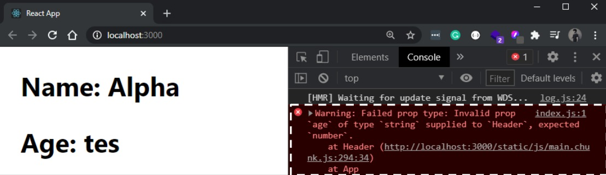
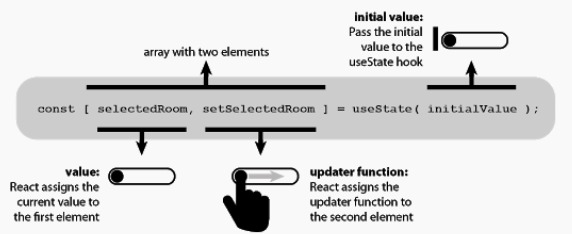
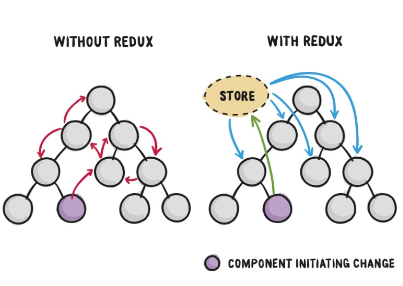

# Writing Week-2 FE Bootcamp

## React.js Lanjutan
**Prop Types**
- merupakan sebuah library yang dapat membantu untuk **memeriksa data props** yang di kirim agar sesuai dengan ekspetasi

sebelum itu kita harus menginstall nya dengan cara
>npm install prop-types

contoh kasus prop types uamg sesuai
```js
import PropTypes from 'prop-types'; //lakukan import propytyprd

function Header(props) {
    return (
        <>
            <h2>Nama : {props.nama}</h2>
            <h2>Usia : {props.usia}</h2>
        </>
    )
}

Header.propTypes{
    nama: PropTypes.string,
    usia: PropTypes.number
}
```



berikut pesan error apabila data yang dimasukkan tidak sesuai permintaan.

**Hooks**
- Hooks fitur yang baru dikenalkan di ReactJS pada tahun 2018
- Hooks berfungsi untuk memudahkan pengguna *functional components* agar bisa menggunakan state, dan lifecycle lainnya
- sebelumnya, state (setState) dan lifeCycle (componentDidMount, componentDidUpdate) hanya bisa digunakan di **class component**, tetapi dengan adanya hooks kita bisa menggunkannya di **functional component**
- Hooks yang sering digunakan :
    - useState dan useEffect.

### perbedaan penulisan functional component dengan class component
- Functional Component
```js
import {usetState} from 'react' ;

function app () {
    const [nama, setNama] = useState("Thobie");

    return(
        <>
            <h1>Hello, {nama}</h1>
        </>
    )
}
// OUTPUT 
// Hello, Thobie
```

- Class Component
```js
class component extends React.Component {
    constructor(props) {
        super(props);
        this.state = {nama : "Thobie"};
    }

    render() {
        return <h1>Hello, {this.state.nama}</h1>
    }
}
// OUTPUT
// Hello, Thobie
```

dari perbandingan code diatas dapat kita lihat bahwa dengan **menggunakan** functional component dan Hooks. code yang diketikkan terlihat lebih pendek dan mudah dipahami

useState Syntax Structure



 ### cara penggunaan useState Hooks
1. import useState dari react `import { useState } from 'react' ; `
2. syntax useState `const [nama, setNama] = useState ('thobie') `
3. memanggil data `<p> halo, saya {nama}</p>`
4. update data `<button onClick={ setNama('raihan')}> ubah </button> `
5. contoh

```js
import { useState } from 'react' ;

function App() {
    const [nama, setNama] = useState('thobie')

    return(
        <>
            <p>halo, saya {name}</p>
            <button onClick={ () => setNama('raihan')}> ganti </button>
    )
};

// OUTPUT
// "halo, saya thobie" akan berubah menjadi "halo, saya raihan" setelah button ganti di klik
```

### cara penggunaan useEffect Hooks
- biasa digunakan saat membuat suatu call API
- useEffect merupakan hooks yang bisa digunakan untuk menggunakan lifecycle pada functional components dengan mudah
- useEffect bisa dimasukkan sebelum melakukan render, useEffect biasanya ditempatkan dibawa useState
- setiap code yang kita tuliskan dalam useEffect akan dijalankan setiap component baru di mount (componentDidMount), terjadi perubahan (componentDidUpdate), dan pada saat meninggalkan component (componentWillUnmount)

step penggunaan useEffect
1. import { useEffect } from 'react' ;
2. penggunaan useEffect sebelum render
```js
useEffect(() => {
    console.log("terjadi perubahan")
}, [nama])
```

Full code
```js
import { useEffect } from 'react' ;

function App() {
    const [nama, setNama] = useState(true);
    const [changed, setChanged] = useState(0);

    useEffect(() => {
        console.log("ada perubahan");
        setChanged(changed + 1);
    }, [nama])

    return(
        <>
            <p>perubahan : {changed}</p>
            <button onClick={ () => setNama('raihan')}> ganti </button>
    )
};
```

## React Router 6
- Routing merupakan proses pemetaan antara sebuah URL ke dalam sebuah halaman yang terdapat konten sesuai dengan URL yang dituju.
- tambahkan library `react-router-dom` dan `react-router`.
    >npm install react-router-dom react-router
- lakukan import `BrowserRouter`, `Route`, dan `Routes`.
    - `BrowserRouter` berfungsi sebagai router yang melakukan API history, sehingga dapat menggunakan *location* untuk mengsingkronasi UI dengan URL.
    - `Route` digunakan untuk merender UI saat path cocok dengan URL saat ini. di dalam component tersebut bisa ditambahkan `exact` yang bertugas untuk memastikan Route hanya merender component yang memiliki path dan location.pathname yang cocok.
    - `Routes` digunakan untuk membungkus `Route` yang mana hanya akan merender Route saat path nya cocok dengan URL.

terdapat 2 jenis Router yang dapat kita gunakan, yaitu
- HashRouter
- BrowserRouter

perbedaan diantara 2 jenis Router tersebut
- HashRouter digunakan apabila membuat web yang static tidak ada server untuk me-render data yang dinamis.
- BrowserRouter digunakan sebaliknya, jika membuat web yang menggunakan data dinamis dengan server Back-End maka menggunakan `BrowserRouter`.

Seperti yang kita ketahui, React menggunakan method ReactDom.render() untuk me-render root component kita ke dalam DOM, kode tersebut terdapat di index.js. Yang harus kita lakukan untuk memasang router adalah dengan me-wrap root component kita dengan BrowserRouter seperti berikut:
```js
import { render } from "react-dom";
import { BrowserRouter } from "react-router-dom";
import App from "./App";

const rootElement = document.getElementById("root");
render(
  <BrowserRouter>
    <App />
  </BrowserRouter>,
  rootElement
);
```

Dynamic Routes

`src/App.js`, import `LINK`
```js
import { Link } from "react-router-dom";

export default function App() {
  return (
    <div>
      <h1>Bookkeeper</h1>
      <nav>
        <Link to="/ListBook">ListBook</Link> |{" "}
        <Link to="/Books/:id">Books</Link>
      </nav>
    </div>
  );
}
```

Add Routes
`src/routes/Books.jsx`
```js
import { useParams } from "react-router-dom"

export function Book() {
  const { id } = useParams()

  return (
    <h1>Book {id}</h1>
  );
}
```

`src/routes/ListBook.jsx`
```js
export default function ListBook() {
  return (
    <>
      <h2>ListBook</h2>
    </>
  );
}
```

React Router cara merender aplikasi kita di URL yang berbeda dengan membuat "Route Config" pertama kita di dalam `main.jsx` atau `index.js`.

`src/main.jsx`
```js
import { render } from "react-dom";
import { BrowserRouter, Routes, Route } from "react-router-dom";
import App from "./App";
import BookList from "./routes/BookList";
import Books from "./routes/Books";

const rootElement = document.getElementById("root");
render(
  <BrowserRouter>
    <Routes>
      <Route path="/" element={<App />} />
        <Route path="BookList" element={<BookList />} />
        <Route path="Books/:id" element={<Books />} />
    </Routes>
  </BrowserRouter>,
  rootElement
);
```
Perhatikan di path "/" itu merender `<App>`. Pada "/Books" itu membuat `<Book />`.

Ketika rute memiliki Children route, ia melakukan dua hal:

1. menyarangkan(nested) URL ("/" + "BookList" dan "/" + "Books")
2. Ini akan menyarangkan komponen UI untuk tata letak bersama ketika children route yang cocok:
Namun, sebelum (poin 2) berfungsi, kita perlu merender Outlet di rute "parent" App.jsx.

`src/App.jsx`
```js
import { Outlet, Link } from "react-router-dom";

export default function App() {
  return (
    <>
      <h1>Bookkeeper</h1>
      <nav>
        <Link to="/Books/:id">Books</Link> |{" "}
        <Link to="/BookList">BookList</Link>
      </nav>
      <Outlet />
    </>
  );
}
```

Nested Routes
```js
<Routes>
  <Route path="/" element={<Home />} />
  <Route path="/books">
    <Route index element={<BookList />} />
    <Route path=":id" element={<Book />} />
    <Route path="new" element={<NewBook />} />
  </Route>
  <Route path="*" element={<NotFound />} />
</Routes>
```
## State Management - Redux
- **Redux** dikenal sebagai library untuk untuk memonitor keadaan state kita saat ini/menampilkan data dan mengelola data.
- Redux dapat diibaratkan sebagai database pada sisi front-end.
- kita dapat melakukan operasi database, seperti :
    - query
    - filter
    - insert
    - delete
- redux tidak menyebutnya dengan database melainkan *Store* dan hanya ada **satu store** dalam satu aplikasi yang disebut *Single Source of Truth*.
- dengan menggunakan redux kita bisa membuat solusi global state.
- pusing-pusing mengelola state per komponen, state dari setiap komponen di pindahkan ke global state yang disebut *store*.
- Store ini akan terhubung dengan komponen. Selanjutnya kita hanya perlu berurusan dengan storenya si redux. Redux yang akan mengurus komunikasi komponent dan perubahan UI.



- gunakan redux jika
    - Banyak data yang berubah dari waktu ke waktu
    - Pengelolaan state harus dilakukan di satu tempat (Single source of truth)
    - Mengelola state di top-level component sudah tidak lagi relevan

### Konsep Dasar
ada 4 istilah yang digunakan dalam Redux yang wajib untuk diketahui.

- Actions
Sebuah JavaScript Object mewakili apa yang terjadi di dalam aplikasi.

- Reducers
Function yang menerima object state dan object action, bertugas menentukan bagaimana suatu state diubah. Output reducer adalah state baru.

>Syntax: (state, action) => newState

- Store
Tempat dimana global state disimpan.

- Dispatch
Satu-satunya cara untuk mengubah state di dalam store adalah dengan memanggil method bernama dispatch yang berisi object action, kemudian Redux akan mengeksekusi reducer yang sesuai.

- Selector
Function yang digunakan untuk mendapatkan data dari state yang ada di dalam store.

### 3 Konsep Dasar
- Single Source of Truth
Redux menggunakan store sebagai single source of truth, dimana semua global state disimpan dalam bentuk object di dalam store.

- State is Read Only
Untuk menghindari data diubah tanpa sengaja atau terhapus, state hanya bisa diubah dengan cara dispatch suatu action.

- Changes are Made with Pure Reducer Function
State diubah menggunakan pure function (Reducer), yaitu function menerima state sebelumnya dan sebuah action, kemudian menghasilkan state baru tanpa menghapus state sebelumnya.

## State Management - Async Actions With Redux Thunk and Middleware
