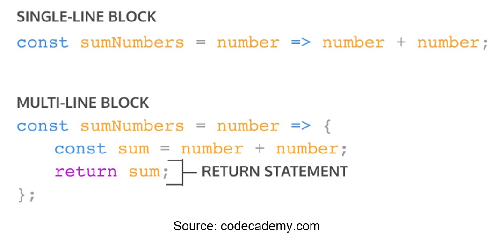

# Writing Test Week-2

## Javascript Scope
**Scope** merupakan konsep dalam flow data variabel. untuk menentukan suatu variabel **dapat diakses** pada scope **tertentu** atau **tidak**.
>yaitu global dan local, 

Analoginya seperti ini:
- Kita semua bisa melihat bintang-bintang dilangit karena bumi bersifat **global**.

- Namun jika kamu tinggal di Bandung, kamu tidak akan bisa melihat monas yang berada di jakarta. Monas bersifat **local** yaitu hanya berada di Jakarta.

kedua ini memiliki keterkaitan keberadaan tentang **global** dan **local**

### Blocks
Blocks merupakan code yang terletak didalam kurung kurawal `{}`. 

3 ini menggunakan blocks: 
- conditional
- function
- looping

mari kita lanjutkan pembahasan terkait **global scope** dan **local scope**.

### Global Scope
global scope **harus** dideklarasikan diluar **blocks** `{}` agar dapat diakses dimanapun dalam suatu file.

contoh:
```js
let myName = 'Raihan Baik' ;

function greeting() {
    return myName
}

console.log("Haloo", myName)
// OUTPUT
'Haloo Raihan Baik'
```

### Local Scope
local scope **harus** dideklarasikan didalam **blocks** `{}` maka membuat variabel **hanya bisa** diakses dalam **blocks** saja.

contoh:
```js
function greeting() {
    let myName = 'Raihan baik' ;
    return myName
}

console.log("Haloo", greeting())
// OUTPUT 
'Haloo Raihan Baik'
```
<hr>

## Javascript Function
**function** merupakan sebuah blok kode yang dapat dipanggil di bagian lain kode. Fungsi dapat memiliki serangkaian pernyataan atau statement untuk menyelesaikan suatu fitur

- function sangat dibutuhkan agar programmer dapat dengan mudah memanage code dan tracing code jika terjadi suatu kesalahan/*error*

syntax:
```js
function name(param) {
    statement;
};
```
> Catatan
>- **name** : nama fungsi.
>- **param** (opsional) : parameter atau nama untuk nilai argumen yang diteruskan ke fungsi, jika parameter lebih dari satu dipisahkan dengan koma.
>- **statements** (opsional) : statement atau pernyataan termasuk ekspresi, logika, perulangan dan sebagainya.

contoh:
```js
function greeting() {
    console.log("Hello World!")
}
// fungsi greeting akan mencetak "Hello World!" bila dipanggil
```

**cara memanggil suatu fungsi**
```js
greeting() // memanggil fungsi
console.log(greeting()); // OUTPUT "Hello World!"
```

### Parameter dan Argumen
- **parameter** merupakan nama variabel atau nilai yang diteruskan ke badan fungsi. Parameter ditulis di dalam kurung lengkung fungsi.
- parameter membuat fungsi dapat menerima sebuah inputan data dan menggunakannya untuk melakukan tugas
```js
function penambahan (a, b) { // ini parameter
    return a + b ;
}
```
**contoh:**
> 

>pada gambar diatas, parameter menerima 2 inputan data *width* dan *height* yang digunakan sebagai variable dalam fungsi untuk menyelesaikan tugas.

- **Argumen** merupakan nilai yang digunakan saat memanggil function
- jumlah argumen **harus sama** dengan jumlah parameter
```js
function penambahan (a, b) {
    return a + b ;
}

console.log(penambahan(5, 5)); // ini Argumen
```
**contoh:**
> 

>pada gambar diatas, argument memiliki jumlah yang sama dengan parameter.

### Default Parameter
- digunakan untuk memberikan nilai awal/*default* pada parameter function.
- nilai default parameter fungsi adalah **undefined**. apabila kita tidak meneruskan argumen saat pemanggilan function.

contoh:
```js
function hi(nama) {
  const pesan = 'Hi, ' + nama;
  console.log(pesan); // Hi, undefined
}

hi(); // tanpa argumen
```
- default parameter digunakan jika kita ingin menjaga function agar tidak error saat dipanggil tanpa argumen.

contoh:
```js
function greeting(name = 'Raihan') {
    return 'Hello' + name;
}

console.log(greeting('rafi')); // OUTPUT : 'Hello Rafi'
console.log(greeting()); // OUTPUT : 'Hello Raihan'
```
dapat terlihat perbedaan diatas apabila kita tidak memberikan argumen makan argumen akan memasukkan default param ke dalam function.

### Arrow Function
- Arrow Fucntion merupakan cara lain untuk menuliskan function.
- tidak memerlukan kata kunci **function**, yang diperlukan adalah tanda panah diantara kurung lengkung`()` dan kurung kurawal`{}`.

syntax:
```js
(parameter) => {
    statement;
};
```
contoh:
```js
const greeting = () => {
    return 'Hello World';
};

const penambahan = (a, b) => {
    return a + b;
}
```

Short Syntax Function




### Error & Bug
- Error adalah suatu kesalahan dari pihak developer dan menyebabkan kita tidak dapat mengkompilasi atau menjalankan aplikasi tersebut karena kesalahan pengkodean.

- Bug adalah kesalahan pada aplikasi yang menghasilkan hasil yang tidak diinginkan sehingga aplikasi tidak berfungsi sebagaimana mestinya atau crash.


<hr>

## Javascript Data Type
JavaScript adalah bahasa dinamis. Variabel dalam JavaScript tidak secara langsung terkait dengan jenis nilai tertentu, dan variabel apa pun dapat diberi (dan ditetapkan ulang) nilai dari semua jenis.

contoh:
```js
let foo = 42; // foo number
foo = "bar"; // foo string
foo = true; // foo boolean
```

JavaScript juga merupakan bahasa yang diketik dengan lemah, yang memungkinkan **konversi** tipe implisit saat operasi melibatkan tipe yang tidak cocok, alih-alih melempar kesalahan tipe.
```js
const foo = 42; // foo number
const result = foo + "1"; // JavaScript memaksa foo string, agar ia dapat berfungsi pada program
console.log(result); // 421 yang membuat output menjadi seperti ini, bukan menjumlahkan tetapi menambahkan string 1 ke foo number.
```

### Tipe data dalam Javascript
- **Boolean** merupakan tipe data yang memiliki nilai true / false (1 / 0)

        Boolean sering digunakan untuk memutuskan bagian kode mana yang akan dieksekusi (seperti dalam pernyataan if) atau ulangi (seperti dalam perulangan for).

- **Null** merupakan salah satu tipe data yang berarti tidak bernilai atau tidak memiliki nilai. Meskipun demikian, null tidak sama dengan string kosong.
    
        String kosong berarti string yang tidak terisi nilai. Jika menggunakan typeof, maka null adalah object. Ini berarti null merupakan sebuah object yang tidak memiliki nilai.

- **Undefined** merupakan sebuah hasil yang didapat dari sebuah proses.Secara mudah, undefined merupakan nilai yang sudah dideklarasi namun belum didefinisikan atau belum diberi nilai

        Jika dilihat sekilas, undefined memiliki persamaan dengan null. Namun demikian, pengertian undefined dianggap lebih dalam dari pada null. Jika null merupakan sebuah objek khusus, maka jika menggunakan typeof undefined adalah undefined.

        Beberapa proses yang akan menghasilkan undefined diantaranya adalah :
        - Proses pemanggilan variabel yang belum didefinisikan.
        - Proses pemanggilan object yang belum ada
        - Proses pemanggilan fungsi yang tidak mengembalikan nilai

- **Number** merupakan tipe data yang digunakan untuk menunjukan angka, baik positif maupun negatif.

        tipe data number juga bisa mengeluarkan nilai NaN. Nan merupkan Not a Number, sebuah nilai hasil dari operasi matematika yang biasanya tidak valid, salah, ataupun nilai yang tidak terdefinisikan seperti hasil dari membagi dengan angka nol.

        Secara lebih spesifik, tipe data ini juga bisa dipecah menjadi dua tipe data lain yaitu integer dan float.

    - **NaN**
    
        Tipe data JavaScript **NaN** atau *Not a Number* digunakan untuk merepresentasikan sebuah kesalahan. Kesalahan dalam penghitungan, hal itu terjadi karena perbedaan tipe data. Seperti halnya string dengan number. Proses aritmatika yang salah, sebuah string tidak dapat dihitung dengan numbernya.

- **BigInt** merupakan numerik dalam JavaScript yang dapat mewakili bilangan bulat dengan presisi arbitrer.

        Dengan BigInts, kita dapat dengan aman menyimpan dan mengoperasikan bilangan bulat besar bahkan di luar batas bilangan bulat aman untuk Numbers dan dapat menggunakan operator +, *, -, **, dan % dengan BigInts seperti halnya dengan Numbers.

- **String** merupakan tipe data yang tidak dapat dijumlahkan. Umumnya yang berisi kata atau kalimat dan bisa juga sebuah angka. Namun tidak dapat menjumlahkannya dengan tipe data number.

        Penulisan tipe data dari string diawali dan diakhiri dengan tanda kutip (“). Selain itu juga bisa menggunakan tanda kutip tunggal (‘). Setiap karakter yang terbalut dengan kutip satu (‘) atau kutip dua (“). Penulisan tersebut yang dianggap sebagai string oleh JavaScript.

        Kadang anda membutuhkan kombinasi diantara keduanya. Tipe data yang satu ini biasa penggunaannya untuk memuat data. Seperti nama seseorang, nama benda, alamat dan kata atau kalimat.

- **Array**  merupakan tipe data yang digunakan untuk menyimpan banyak nilai pada satu variabel.

        Setiap nilai, atau pada tipe data ini disebut elemen akan memiliki posisi sendiri yang disebut indeks. Setiap nilai ini juga bisa berisi banyak tipe data lain. Tipe data ini biasa digunakan untuk membuat pilihan dengan banyak objek.


- **Object** merupakan sebuah variabel yang menyimpan nilai (properti) dan fungsi (method).

- **Symbol** merupakan tipe data baru setelah kehadiran ECMAScript 6 (ES6). Tipe data simbol yang digunakan sebagai pengenal properti objeknya.


### Math
**Math** adalah objek yang berisi fungsi-fungsi matematika dan beberapa konstanta untuk melakukan perhitungan matematika seperti sin, cos, tan, eksponen, akar kuadrat, dll.

Objek Math di Javascript menyediakan fungsi sebagai berikut:
- log() untuk algoritma
- pow() untuk pemangkatan 
- exp() untuk menghitung eksponensial
- floor() membulatkan ke bawah;
- round() membulatkan ke yang terdekat, bisa ke bawah dan ke atas;
- ceil() membulatkan ke atas.
- sqrt() untuk menghitung akar
- cbrt() untuk menghitung akar kubik

### Primitive & Non-Primitive
- Tipe data primitif memiliki sifat immutable dan tidak memiliki properties.
- Tipe data Non-primitif bersifat mutable dan memiliki properties. 

>Maksud dari immutable itu setelah pertama kali diinisiasi, nilai tersebut tidak bisa diubah lagi dalam memori. Nilai yang tersimpan dalam memori akan tetap sama seperti pertama kali

contoh tipe data primitif & Non-primitif

**Primitif**
1. Numbers
2. Strings
3. Booleans
4. Undefined
5. Null

**Non-Primitif**
1. Objects
2. Arrays

<hr>

## DOM HTML
- DOM merupakan cara memanipulasi html agar website lebih dinamis dan interaktif
- Cara memanggil DOM Value yaitu :
  - Memanggil tag HTML berdasarkan ID
    >`console.log(document.getElementByID("header))`
  - Memanggil tag HTML berdasarkan Class Name 
    >`console.log(document.getElementByClassName("text-color-blue"))`
  - Memanggil tag html berdasarkan query selector
    >`console.log(document.querySelector("#header "))`
    >`console.log(document.querySelector(".text-color-blue"))`

- Memanipulasi content

  Cara memanipulasi content :
  - Deklarasi varible header sebagai wadah untuk menyimpan tag HTML
        >`let header = document.getElementById("header"); `
  - Memanipulasi Content pada Header Content dari pemilik element dengan ID Header dengan text.Content
        >`document.getElementById("header").textContent = "Teks Heading" `

Memanipulasi Content didalam sebuah element dengan .innerHTML
  ```js
  <ul id= "list"></ul>

  document.getElementById("list").innerHTML = "<li> item1 </li> <li> item2 </li>"
  ```
- Membuat Element HTML
- Contoh :
  ```js
  <div id ="header"></div>

  //untuk membuat sebuah elemnt heading
  const heading = dosument.createElement("h1)
  heading.textContent = "Ini Heading"

  document.getElemntByID("header").appendChild(heading)
  ```

- **DOM Events** merupakan object model yang bertugas untuk membantu interaksi user dengan document HTML. 

- Contoh HTML DOM events
  - Click
  - Scroll
  - Change
  - Focus
  - Hover
  - Submit
  - Blur

- Menangkap Interaksi User
  - Element.addEventListener("event)
  - Element.onevent

- EventListener

  Dengan menggunakan Element.addEventListener("event") dapat menerapkan beberapa hal yaitu :
  - Bisa dihilangkan
  - Bisa ada beberapa event listener yang sama untuk 1 element
  - Memiliki argument tambahan {options}

- Contoh EventListener :
  - EventListener - Click 
    `` <input id="user-input"/> ``
    `` <button id="alert-button">show</button> ``
    Memanggil element berdasarkan id
    `` const input = document.getElementById("user-input") ``
    `` const button = dosument.getElementById("alert-button") ``

    ```js
     button.addEventListener("click", function()) {
      alert(input.value)
    } 
    ```
- EventListener - Blur : event dimana sebuah element kehilangan fokus dari user 
- Contoh EventListener - Blur <br />
  Misalkan saat ingin memvalidasi isi dari ``<input id = "username" />`` agar panjangnya minimal 6 karakter

  `` const input = document.getElementById("username") ``

  ```js
  input.addEventListener("blur", () => {
    if(input.value.length < 6) alert("Panjang username minimal 6")
  })
  ```
- EventListener - Form Submission
- Contoh EvenListener - Form Submission <br />
  Misalkan terdapat beberapa input dalam sebuah form ` <input name="email"/> ` dan `<input type="password" name="password"/>` <br />
  Untuk mendapatkan isi dari kedua inputan tersebut terdapat 2 cara :
  - Memasang event listener di kedua input dan tombol submit, lalu saat tombol diklik, baca value dari kedua input tersebut
  - Memasang event listener di form, lalu gunakan FormData untuk menggambil data dari masing-masing input
  
  ```js
    const form = document.getElementById("form")

    form.addEventListener("submit", function(event)){
    event.preventDefault()

    const formData = new FormData(form)
    const values = Object.fromEntries(formData) {
      email: ....
    }
  })
  ```

<hr>
