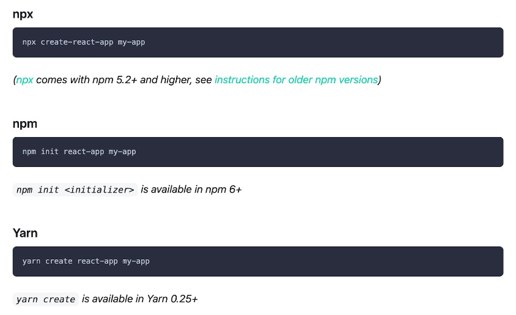
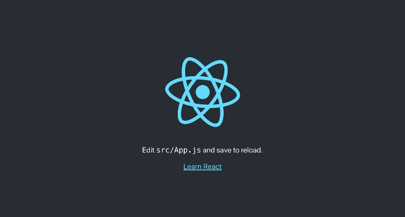
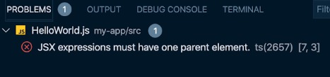
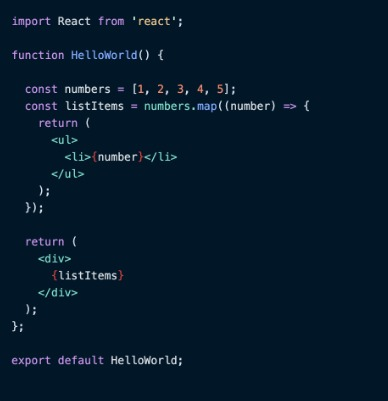
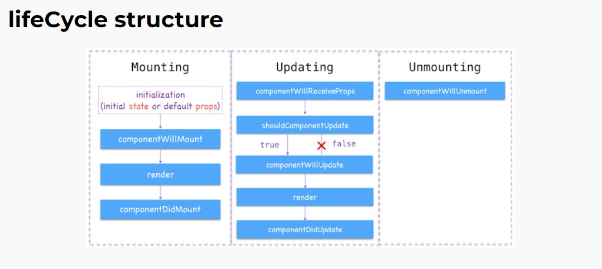
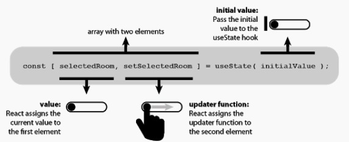

# Writing Week-1 FE Bootcamp

## React JS Dasar
- React merupakan framewoek view library Javascipt untuk membuat tampilan UI (*User Interface*) pada sebuah website.

### alasan menggunakan React JS
- mempercepat proses pembuatan aplikasi Front-End
    >memungkinkan Anda untuk menggunakan kembali komponen yang telah dikembangkan ke aplikasi lain yang menggunakan fungsi yang sama.
- membantu menghandle berbagai data
- dapat menerapkan konsep **Modular** JS yang membagi 1 tampilan menjadi komponen-komponen kecil (SPA / *Single Page Application*)
- dapat digunakan untuk aplikasi yang berskala kecil hingga besar dan kompleks
- komunitas React JS yang sangat besar membantu mempermudah mendapatkan pekerjaan, karena kebanyakan perusahaan teknologi pun menggunakan React JS

### menjalankan React JS
1. Install Node JS (untuk dapat menggunakan npm)
2. gunakan library 'create-react-app my-app'
3. kita bisa menggunakan 3 perintah untuk membuat react
    
4. maka folder 'my-app' akan dibuat, untuk mengaksesnya bisa gunakan `npm start` atau akses localhost3000. maka tampilan default yang akan muncul seperti ini.
    

### perbandingan membuat UI element dengan Vanilla JS dan React JS
**VANILLA JS**
```html
<!DOCTYPE html>
<html lang="en">
<head>
    <meta charset="UTF-8">
    <meta http-equiv="X-UA-Compatible" content="IE=edge">
    <meta name="viewport" content="width=device-width, initial-scale=1.0">
    <title>Vanilla JS</title>
</head>
<body>
    <div class="container">

    </div>
</body>
<script>
    //GET DOM
    const container = document.getElementsByClassName('container');
    //CREATE ELEMENT
    const element = document.createElement('div')
    //CREATE CONTENT
    element.textContent = 'Hello World' ;
</script>
</html>
```

**OUTPUT**


**REACT JS**
```js
//CREATE ELEMENT
function HelloWorld() {
    return(
        <h1>Hello World</h1>
    )
};

//EXPORT ELEMENT to APP
export default HelloWorld;
```

```js
import HelloWorld from './HelloWorld';

function App() {
    return(
        <>
            <HelloWorld />
        </>
    )
};

export default App;
```

**OUTPUT**


### Mengenal JSX
- JSX adalah *JavaScript Syntax Extension* yang dikembangkan untuk digunakan pada React JS
- JSX akan dicompile menjadi JS sebelum ditampilkan pada browser
- dengan begitu kita dapat menggunakan HTML didalam file extension JS

Setiap JSX hanya bisa memiliki 1 parent element, apabila terdapat lebih dari 1 maka akan muncul error
```js
function HelloWorld(){
    return(
        <h1>Hello World</h1>
        <h2>Selamat</h2>
    )
};
```



solusinya ialah dengan membungkus ke 2 element tersebut dengan 1 parent
```js
function HelloWorld(){
    return(
        <>
            <h1>Hello World</h1>
            <h2>Selamat</h2>
        </>
    )
};

export default HelloWorld;
```

## Virtual DOM
- DOM manipulation merupakan core dari Javascript
- kita dapat berinteraksi dengan DOM
- Virtual DOM ialah Duplikasi dari real DOM
- React JS mempunyai fitur Virtual DOM

contoh :
- apabila terjadi suatu perubahan dalam salah 1 komponen UI dalam 1 page. maka update data yang dilakukan hanya pada komponen yang terjadi perubahan sehingga react js tidak melakukan render ulang 1 page. ini yang membuat React JS menjadi lebih cepat dalam hal performance.

## Penamaan pada JSX
- Class -> ClassName 
```js
function HelloWorld(){
    return(
        <>
            <h1 ClassName="judul">Hello World</h1>
            <h2>Selamat</h2>
        </>
    )
};

export default HelloWorld;
```

### penggunaan Curly Braces `{}`
- untuk menggunakan syntax JavaScript di element HTML
```js
function HelloWorld(){
    return(
        <>
            <h1>{1 + 2}</h1>
        </>
    )
};

export default HelloWorld;
//OUTPUT menghasilkan operator penjumlahan
// 1 + 2 = 3
// bukan mencetak 1 + 2
```

- Variable menggunakan Curly Braces `{}`
```js
function HelloWorld(){
    const name = 'thobie'
    return(
        <>
            <h1>{name}</h1>
        </>
    )
};

export default HelloWorld;
// OUTPUT h1 ialah "thobie"
```

- Event 
```js
function HelloWorld(){
    const name = 'thobie'

    const onClickFunction = () => {
        alert('You Clicked Button')
    }

    return(
        <>
            <h1>{name}</h1>
            <button onClick={onClickFunction}>Klik</button>
        </>
    )
};

export default HelloWorld;
```

### .map()


## Component
- salah satu core dari React JS yang membagi UI dalam bagian-bagian kecil
- dapat membuat SPA (*Single Page Application*)
- bersifat *reuseable code*

### cara membuat component
- mayoritas kasus dan dokumentasi resmi React JS **merekomendasikan** menggunakan *function* :

1. FUNCTION 
- 
```js
function App() {
    return(
        <>
            <h1>Hello World</h1>
        </>
    )
};
```

2. CLASS
```js
class App extends Component {
    render() {
        return(
            <>
                <h1>Hello World</h1>
            </>
        )
    };
};
```

terlihat dari perbedaan diatas alasan mengapa mayoritas merekomendasikan penggunaan **Function Component** karena syntax yang lebih singkat dalam membuat suatu component.

## State dan Props pada React JS
- State

    State adalah data private sebuah component. Data ini hanya tersedia untuk component tersebut dan tidak bisa di akses dari component lain.

    sebuah objek untuk menyimpan data pada React dan akan di render ketika data mengalami perubahan.

    - Terdapat 2 jenis state, yaitu :
    1. Stateful
        Stateful components adalah komponen yang menggunakan state. (memiliki state dan bisa mengirim state ke component)
    2. Stateless
        Stateless adalah komponen yang tidak menggunakan state. (tidak memiliki state dan hanya memiliki props)

- Props

    Prop singkatan dari *Property*. Ini cukup simple, apalagi jika sudah terbiasa dengan HTML, ini mirip seperti atrribute pada tag HTML. Dalam pembuatannya, jika dalam functional component maka prop ini adalah parameternya.

    data yang dapat di akses antar komponen satu dengan komponen lainnya

## cara membuat styling pada React JS
terdapat 2 cara yang dapat diimplementasikan untuk membuat styling di React JS

**1. import css di setiap component**

secara kasar ini sama saja seperti membuat file eksternal CSS pada React namun pemanggilannya mennggunakan `import`.

```js
    import logo from './logo.svg';
    import './App.css';

    function App() {
    return (
        <div className="App" style={{ maxHeight: "20rem", padding: "10px", margin: "10px" }}>
            <header className="App-header">
            
            <p>
            Edit <code>src/App.js</code> and save to reload.
            </p>
            <a
            className="App-link"
            href="https://reactjs.org"
            target="_blank"
            rel="noopener noreferrer"
            >
            Learn React
            </a>
            </header>
        </div>
    );
    }

    export default App;
```

**2. membuat Inline CSS**

sesuai namanya Inline yang dimana kita memberikan style pada tag yang dituju, terdapat perbedaan untuk penggunaan style inline css pada react JS dibandingkan pada html biasa, yaitu:
    - menggunakan double Curly Braces `style={{}}`
    - menggunakan camelCase `style={{backgroundColor:"red"}}`

```js
    import logo from './logo.svg';
    import './App.css';

    function App() {
    return (
        <div className="App" style={{ maxHeight: "20rem", padding: "10px", margin: "10px" }}>
            <header className="App-header">
            
            <p>
            Edit <code>src/App.js</code> and save to reload.
            </p>
            <a
            className="App-link"
            href="https://reactjs.org"
            target="_blank"
            rel="noopener noreferrer"
            >
            Learn React
            </a>
            </header>
        </div>
    );
    }

    export default App;
```

### Lifecycle Method
- dianggap seperti lingkaran kehidupan mulai dari bangun tidur hingga tidur kembali.
- lifecycle di dalam hooks, hanya menggunakan useEffect yang menyatukan
    1. componentDidMount
    2. componentDidUpdate
    3. componentWillUnmount

structure lifeCycle



## React Hooks
- Hooks fitur yang baru dikenalkan di ReactJS pada tahun 2018
- Hooks berfungsi untuk memudahkan pengguna *functional components* agar bisa menggunakan state, dan lifecycle lainnya
- sebelumnya, state (setState) dan lifeCycle (componentDidMount, componentDidUpdate) hanya bisa digunakan di **class component**, tetapi dengan adanya hooks kita bisa menggunkannya di **functional component**
- Hooks yang sering digunakan :
    - useState dan useEffect.

### perbedaan penulisan functional component dengan class component
- Functional Component
```js
import {usetState} from 'react' ;

function app () {
    const [nama, setNama] = useState("Thobie");

    return(
        <>
            <h1>Hello, {nama}</h1>
        </>
    )
}
// OUTPUT 
// Hello, Thobie
```

- Class Component
```js
class component extends React.Component {
    constructor(props) {
        super(props);
        this.state = {nama : "Thobie"};
    }

    render() {
        return <h1>Hello, {this.state.nama}</h1>
    }
}
// OUTPUT
// Hello, Thobie
```

dari perbandingan code diatas dapat kita lihat bahwa dengan **menggunakan** functional component dan Hooks. code yang diketikkan terlihat lebih pendek dan mudah dipahami

useState Syntax Structure



 ### cara penggunaan useState Hooks
1. import useState dari react `import { useState } from 'react' ; `
2. syntax useState `const [nama, setNama] = useState ('thobie') `
3. memanggil data `<p> halo, saya {nama}</p>`
4. update data `<button onClick={ setNama('raihan')}> ubah </button> `
5. contoh

```js
import { useState } from 'react' ;

function App() {
    const [nama, setNama] = useState('thobie')

    return(
        <>
            <p>halo, saya {name}</p>
            <button onClick={ () => setNama('raihan')}> ganti </button>
    )
};

// OUTPUT
// "halo, saya thobie" akan berubah menjadi "halo, saya raihan" setelah button ganti di klik
```

### cara penggunaan useEffect Hooks
- biasa digunakan saat membuat suatu call API
- useEffect merupakan hooks yang bisa digunakan untuk menggunakan lifecycle pada functional components dengan mudah
- useEffect bisa dimasukkan sebelum melakukan render, useEffect biasanya ditempatkan dibawa useState
- setiap code yang kita tuliskan dalam useEffect akan dijalankan setiap component baru di mount (componentDidMount), terjadi perubahan (componentDidUpdate), dan pada saat meninggalkan component (componentWillUnmount)

step penggunaan useEffect
1. import { useEffect } from 'react' ;
2. penggunaan useEffect sebelum render
```js
useEffect(() => {
    console.log("terjadi perubahan")
}, [nama])
```

Full code
```js
import { useEffect } from 'react' ;

function App() {
    const [nama, setNama] = useState(true);
    const [changed, setChanged] = useState(0);

    useEffect(() => {
        console.log("ada perubahan");
        setChanged(changed + 1);
    }, [nama])

    return(
        <>
            <p>perubahan : {changed}</p>
            <button onClick={ () => setNama('raihan')}> ganti </button>
    )
};
```

### Infinite re-render
cara mengatasi re-render
- menambahkan `[]` agar data tidak merender ulang. pada akhir code seperti contoh diatas saya tlah melakukan pembatasan apabila yang terjadi perubahan hanya di nama maka useEffect akan melakukan render ulang