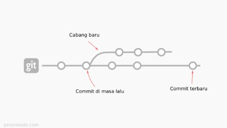
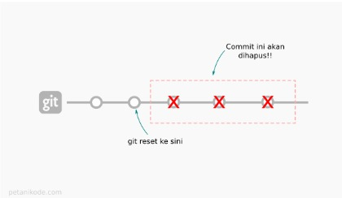
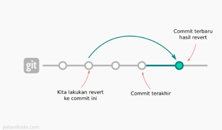
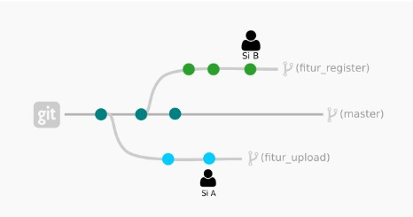
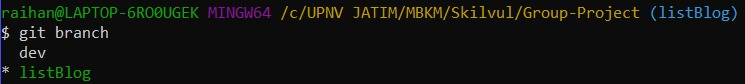
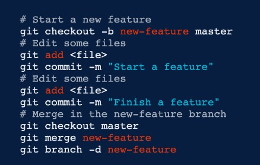
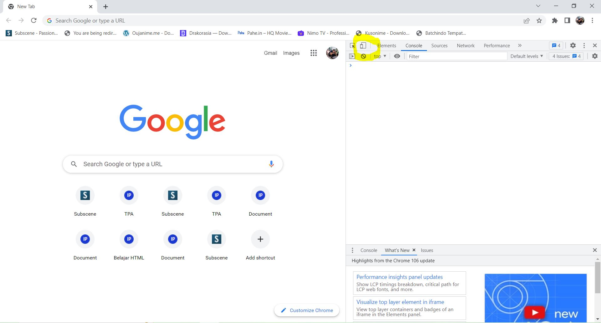
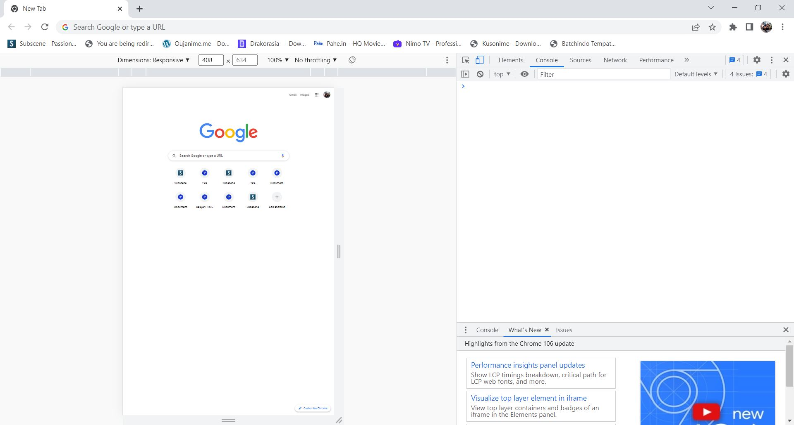
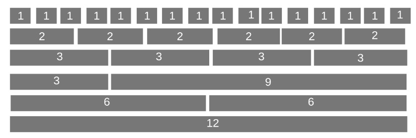
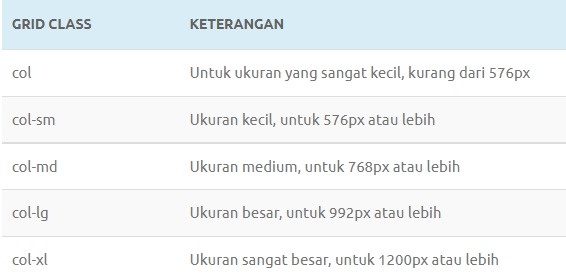

# Writing Week-3

## JavaScript Intermediate - Asynchronous - Fetch
- Dalam JavaScript kita bisa mengirimkan **network request** dan juga bisa mengambil informasi data terbaru dari server jika dibutuhkan.
- Contoh **network request** yang biasa kita lakukan:
    - Mengirimkan data dari sebuah form.
    - Mengambil data untuk ditampilkan dalam list/table.
    - Mendapatkan notifikasi.
- Dalam melakukan **network request**, JavaScript memiliki metode bernama *fetch()*.
- *fetch()* adalah salah satu proses asynchronous di JavaScript sehingga kita perlu menggunakan salah satu diantara *promise* atau *async/await*.

**Fetch dengan Promise**
- Berikut ini contoh request data dengan fetch() menggunakan promise:

```JS
fetch("https://jsonplaceholder.typicode.com/posts")
  .then(function (response) {
    return response.json();
  })
  .then(function (post) {
    console.log(post);
  });
```

**Fetch dengan async/await**
- Berikut contoh request data dengan fetch() menggunakan async/await:

```JS
const tesFetchAsync = async () => {
  let response = await fetch("https://jsonplaceholder.typicode.com/posts");
  response = await response.json();
  console.log(response);
};
tesFetchAsync();
```

- Kita masih mengambil data dari sumber end-point yang sama dengan fetch() sebelumnya yang menggunakan promise sehingga hasilnya pun masih sama persis seperti sebelumnya.

- Ketika menggunakan async/await, kode kita terlihat lebih clean dan mudah dibaca.
<hr>

## JavaScript Intermediate - Asynchronous - Async Await
- Kita bisa menggunakan **async/await** untuk menggunakan asynchronous pada JavaScript. **Async/await** baru ada ketika update JavaScript ES8 dan dibangun menggunakan promise. Jadi sebenarnya **async/await** dan promise itu sama saja, namun hanya berbeda dari syntax dan cara penggunaannya.

- Ada 2 kata kunci yang memiliki pengertian sebagai berikut:
    - **Async**, mengubah function synchronous menjadi asynchronous.
    - **Await**, menunda eksekusi hingga proses asynchronous selesai.

- Sebuah **async** function bisa tidak berisi await sama sekali atau lebih dari satu await. Keyword await hanya bisa digunakan didalam **async** function, jika digunakan di luar **async** function maka akan terjadi error.

**Async**
- Berikut ini contoh penggunaan dari **async** :

```JS
// async menggunakan keyword function 
async function tesAsyncAwait() {
  return "Fulfilled";
}

console.log(tesAsyncAwait());

// async menggunakan arrow function
const tesAsyncAwait = async () => {
  return "Fulfilled";
};

console.log(tesAsyncAwait());
```

**Await**
- **Await** hanya bisa digunakan dalam async function dan **await** adalah keyword dalam **async** yang digunakan untuk menunda hingga proses asynchronous selesai.

- Berikut ini contoh penggunaan dari **async/await** :

```JS
async function tesAsyncAwait() {
   await 'Fulfilled';
}
```

Kita juga bisa memberikan error handling pada async/await. Contoh lengkap penggunaan async/await:

```JS
// Definisikan dahulu promise yang ingin digunakan
let condition = true;
let tesAsyncAwait = async (condition) => {
  if (condition) {
    return "Condition is fulfilled!";
  } else {
    throw "Condition is rejected!";
  }
};

// Membuat fungsi run menjadi asynchronous menggunakan async/await
const run = async (condition) => {
  try {
    const message = await tesAsyncAwait(condition);
    console.log(message);  // Output: Condition is fulfilled!
    console.log("After condition is fulfilled"); // Output: After condition is fulfilled
  } catch (error) {
    console.log(error);
  }
};

run(true);
```
Dari kode di atas, kita dapat melihat bahwa run adalah sebuah fungsi async dan await dipanggil bersamaan dengan fungsi tesAsyncAwait(condition). await pada fungsi ini artinya, console.log pada message dan After condition is fulfilled tidak akan dijalankan (ditunda) hingga proses tesAsyncAwait(condition) selesai dijalankan.
<hr>

## Git & Github Lanjutan
GIT merupakan tools untuk programmer, sebagai Version Control System

- **mencatat** setiap **perubahan** pada file (termasuk code yang kita buat) pada suatu proyek baik dikerjakan secara **individu** maupun **tim** (*Source Code Management*)

- GIT adalah aplikasi yang dapat melacak setiap perubahan yang terjadi pada suatu folder atau file.

- GIT biasanya digunakan oleh para programmer sebagai tempat penyimpanan file program mereka, karena lebih efektif. file-file yang disimpan menggunakan git akan terlacak seluruh perubahannya, termasuk siapa yang mengubah.(*History*)

**_GITHUB_** merupakan layanan *cloud* yang berguna untuk **menyimpan** dan **mengelola** sebuah project yang dinamakan *repository* (repo git). Cara kerja pada GitHub harus terkoneksi pada internet sehingga kita tidak perlu meng-install sebuah software ke dalam perangkat keras. Hal ini memberikan keringanan penyimpanan komputer yang kita gunakan karena file project tersimpan oleh *cloud* GitHub.

### kenapa harus menggunakan GIT & GITHUB?
- Dengan menggunakan GIT dan Github, kamu akan bisa bekerja dalam sebuah tim. 
- Tujuan besarnya adalah kamu bisa **berkolaborasi** mengerjakan proyek yang sama tanpa harus repot copy paste folder aplikasi yang terupdate.
- Kamu **tidak perlu menunggu** rekan dalam satu tim kamu menyelesaikan suatu program dahulu untuk berkolaborasi. 
- Kamu bisa membuat file didalam projek yang sama atau membuat code di file yang sama dan menyatukannya saat sudah selesai. *(berbeda branch dan lakukan merger diakhir)*

**Mari lanjutkan ke demo git**

Setup Awal Git : 
1. git config global user.email raihanthobi@gmail.com (**Email yang digunakan HARUS sama dengan Github**)
2. git config global user.name "Raihan" 
3. git config --list untuk melihat hasil konfigurasi 


4. git init membuat repository Git kosong atau inisialisasi ulang yang sudah ada
5. git status untuk memeriksa perubahan yang terjadi pada Git
6. git add . untuk menambahkan file baru pada Git/perubahan file
7. git commit -m "Pesan Commit" untuk menyimpan perubahan pada Git 
8. git push -u origin master / main untuk mengirim file pada remote repository 
9. git clone (alamat repo) untuk mengambil repository Github ke lokal

GIT LOG
- untuk melihat history perubahan pada project `git log / git log --oneline`
- sangat berguna jika berkolaborasi dengan banyak developer sehingga kalian tahu apa yang di ubah oleh developerg lain dalam project tim yang kalian kerjakan.

GIT CHECKOUT
- membatalkan perubahan pada saat belum stagged dan belum committed 

    `git checkout <nama_file>`
- mengembalikan commit jauh ke bawah dengan git checkout, misal 3 commit sebelum 

    `git checkout HEAD-3 <nama_file>`

GIT RESET
- membatalkan perubahan pada saat sudah stagged namun belum Committed 

    `git reset <nama_file>`
- mengembalikan commit pada file tertentu 

    `git reset <nama_file>`

GIT REVERT
- membatalkan semua perubahan yang ada tanpa menghapus commit terakhir.
- **berbeda** dengan `git reset` yang akan menghilangkan commit terkahir.

    `git revert -n <nomer-commit>`

contoh proses berjalannya ketiga GIT di atas:
-  Git Checkout

    

- Git reset

    

- Git revert

    

GIT BRANCH
- salah satu fitur yang **wajib** digunakan pada saat berkolaborasi dengan developer lain dalam suatu tim.
- bertujuan menghindari conflict code pada project yang dikembangkan
- tidak disarankan untuk berkolaborasi pada 1 branch yang sama
- biasanya digunakan untuk membedakan sebuah fitur dalam project
- branch main/master digunakan untuk deploy hasil akhir dari project
- `git branch <nama-branch>`

    

- sedangkan `git branch` saja. untuk melihat list branch yang ada

    

- kita bisa menggunakan `git checkout <nama-branch>` untuk berpindah branch
- lalu, bagaimana untuk menghapus branch? kita bisa menggunakan `git branch -d <nama-branch>`

GIT MERGE
- sesuai namanya, git merge berfungsi untuk menyatukan/menggabungkan hasil pekerjaan ke dalam suatu branch yang sama.
- tahap pertama, pergi ke branch yang ingin kita merge. misal `branch master`
- `git checkout master`
- lalu lakukan merge `git merge <nama-branch>`

    
<hr>

## Responsive Web Design
- Responsive Web Design digunakan agar desain website kita dapat diakses menggunakan device dengan jenis apapun karena ketika kita membuat sebuah aplikasi, kita juga harus memikirkan device yang digunakan oleh user kita seperti laptop dan smartphone
- Kita bisa menggunakan Chrome Dev Tools pada browser chrome sebagai tools dari Responsive Web Design dengan Ctrl + Shift + J, maka akan menghasilkan output :
  
- Setelah itu kita klik icon yang diberi lingkaran berwarna kuning (menggambarkan smartphone dan tablet).
- Dan akan menjadi :
  
- Meta Viewport sangat dibutuhkan ketika kita akan membuat Responsive Web Design
- Contoh :

```html
<!DOCTYPE html>
<html lang="en">
  <head>
    <meta charset="UTF-8" />
    <meta http-equiv="X-UA-Compatible" content="IE=edge" />
    <meta name="viewport" content="width=device-width, initial-scale=1.0" />
    <title>Contoh Responsive</title>
  </head>
  <body></body>
</html>
```

- Relative unit berguna untuk mendesain website yang responsif karena ukurannya bisa berubah relatif terhadap ukuran layar :

1. % : Ukurannya relatif terhadap parent element
2. em : Ukurannya relatif terhadap font-size dari elemen saat ini
3. rem : Ukurannya relatif terhadap font-size root elemen (<html>). "rem" = "root em"
4. ch : Ukurannya mengikuti jumlah karakter (1 karakter sama dengan lebar dari karakter 0/nol font yang sedang aktif)
5. vh : Ukurannya relatif terhadap tinggi viewport (ukuran jendela tau aplikasi), 1vh = 1/100 dari tinggi viewport
6. vw : Ukurannya relatif terhadap lebar dari viewport. 1vw = 1/100 lebar viewport
7. vmin : Ukurannya relatif terhadap ukuran viewport yang lebih kecil (misalnya diorientasi portrait, lebar akan lebih kecil daripada tinggi). 1vmin = 1/100 dari ukuran viewport yang lebih kecil.
8. vmax : Sama dengan vmin, dia akan melihat ukuran viewport yang lebih besar
9. ex : Ukurannya relatif terhadap tinggi dari karakter "x" kecil font yang sedang aktif.

- Contoh implementasi dari relative unit :

```css
.child {
  margin: 20%;
}
```

- Grid merupakan susunan kerangka yang dibangun atas garis dengan posisi vertikal dan horizontal, grid dipergunakan sebagai alat bantu untuk menyusun atau mengatur objek dalam kontek perencanaan dalam ruang gambar dua dimensi.
- Contoh implementasi Grid :

```css
* {
  box-sizing: border-box;
}

.container {
  max-width: 1280px;
  margin: 0 auto;
  display: grid;
}

.container::after {
  content: "";
  clear: both;
  display: table;
}

[class*="grid"] {
  float: left;
  padding: 15px;
}

.grid1 {
  width: calc((1 / 12) * 100%);
}
.grid2 {
  width: calc((2 / 12) * 100%);
}
.grid3 {
  width: calc((3 / 12) * 100%);
}
.grid4 {
  width: calc((4 / 12) * 100%);
}
.grid5 {
  width: calc((5 / 12) * 100%);
}
.grid6 {
  width: calc((6 / 12) * 100%);
}
.grid7 {
  width: calc((7 / 12) * 100%);
}
.grid8 {
  width: calc((8 / 12) * 100%);
}
.grid9 {
  width: calc((9 / 12) * 100%);
}
.grid10 {
  width: calc((10 / 12) * 100%);
}
.grid11 {
  width: calc((11 / 12) * 100%);
}
.grid12 {
  width: calc((12 / 12) * 100%);
}
```

<hr>

## Bootstrap 5
- Bootstrap merupakan salah satu framework andalan para developer ketika membuat sebuah website karena Bootstrap membantu dalam membuat website dengan sangat cepat dan mudah.
- Bootstrap adalah framework HTML, CSS, dan JavaScript yang berfungsi untuk mendesain website responsive dengan cepat dan mudah.
- Class yang disediakan Bootstrap bisa dibilang cukup lengkap. Mulai dari class untuk layout halaman, class menu navigasi, class animasi, dan masih banyak lainnya.
- Bootstrap bersifat responsive berkat grid system yang digunakan. Sistem grid pada bootstrap menggunakan rangkaian containers, baris, dan kolom untuk menyesuaikan bentuk layout dan konten website yang berarti Bootstrap menjamin tampilan website Anda akan tetap rapi dan konsisten di berbagai perangkat pengunjung. Baik melalui smartphone, tablet, atau laptop.
- kita dapat menggunakan bootstrap ketika membuat suatu project website yang mana harus dibuat dengan cepat dan efisien karena sudah terdapat berbagai macam jenis template yang disediakan oleh bootstrap untuk para developer.

Untuk memahami Layout dan Content tentunya kita harus bisa memahami grid pada bootstrap terlebih dahulu, yang mana akan sangat membantu dalam proses pembuatan tata letak desain dalam project web yang kita buat.

- Didalam bootstrap terdapat 12 grid untuk keseluruhan halaman. Kita dapat membuat 12 kolom untuk mengisi keseluruhan halaman.

    

- dalam membuat website kita menjadi responsive juga terdapat class grid pada bootstrap yang membantu kita menentukan tampilan untuk seluruh perangkat user nantinya.

    

    pada bootstrap 5 saat ini bahkan sudah terdapat class-grid tambahan hingga XXL class.

- Beberapa komponen dasar dari bootstrap, yaitu :
    1. Glyphicon
    2. Dropdown
    3. Button Group
    4. Button Dropdown
    5. Input Group
    6. Navs
    7. Navbar
    8. Breadcrumbs
    9. Pagination
    10. Label
    11. Badge
    12. Jumbroton
    13. Page Header
    14. Thumbnails
    15. Alerts
    16. Progress Bar
    17. Panels
    18. Responsive Embed

contoh penggunaan beberapa komponen pada bootstrap
```html
<!DOCTYPE html>
<html>
<head>
 <!-- Load file CSS Bootstrap offline -->
<link rel="stylesheet" href="css/bootstrap.min.css">
  <script src="js/jquery-3.4.1.min.js"></script>
</head>
<body>

<div class="container">
	<div class="row">
		<div class="col-md-12" style="background-color:AntiqueWhite ;">
		 <h1><center>Judul Halaman</center></h1>
		</div>
	</div>
	<div class="row">
		<div class="col-md-3" style="background-color:GreenYellow;">
		<h2>Silebar</h2>
		<p>Link 1</p>
		<p>Link 2</p>
		<p>Link 3</p>
		<p>Link 4</p>
		</div>
		<div class="col-md-9" style="background-color:LightCyan;">
			<h2>Konten</h2>
			<p>Konten website dapat diisi pada bagian ini</p>
		</div>
	</div>
	<div class="row"style="background-color:MediumPurple;" >
		<div class="col-md-12">
		<h2><center>Footer</center></h2>
		</div>
		
	</div>
</div>

</body>
</html> 
```