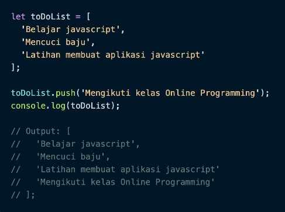
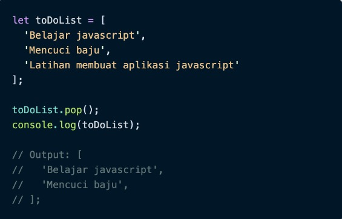
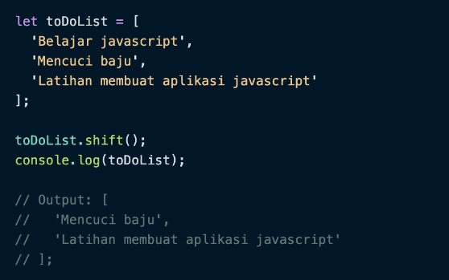
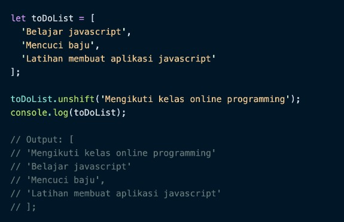
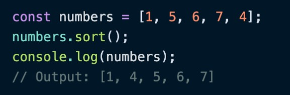
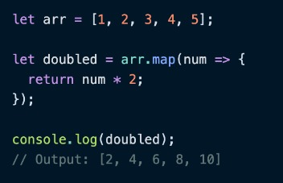
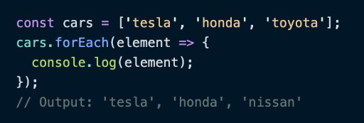
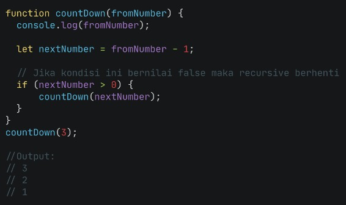
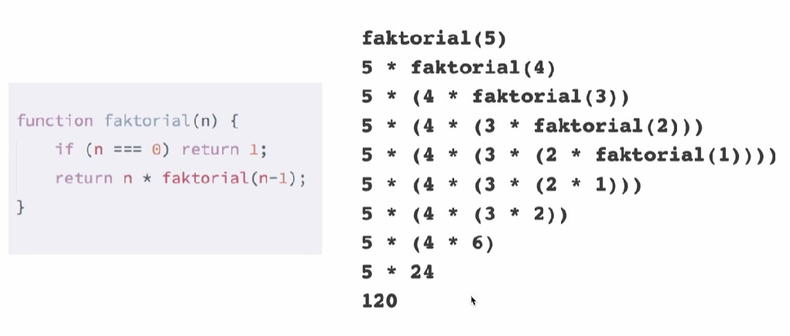
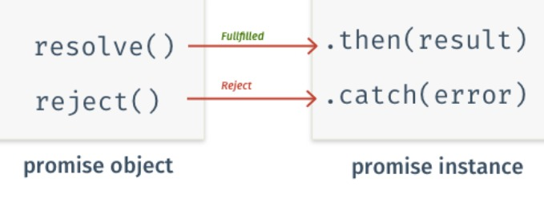

# Writing Week-3

## Javascript Intermediate Array
- Array merupakan **tipe data list order** yang dapat menyimpan tipe data **apapun** di dalamnya (string, Number, Boolean, dan lainnya)
- array didefinisikan dengan menggunakan kurung siku `[]`
- index pada array dimulai dari ke-0 (data pertama)

syntax :
```js
let data = ['string', "masih string", 20, true];
console.log(data)

//OUTPUT 
['string', "masih string", 20 (number), true (boolean)]
index ke [0, 1, 2, 3]
length: 4
```

#### bagaimana cara melakukan **update** data pada array?
- kita bisa melakukannya dengan menunjuk index lalu berikan data baru.
```js
let sekolah = ['SD', 'SMP', 'SMA'];

sekolah[1] = 'Sekolah Menengah Pertama';
console.log(sekolah)

//OUTPUT
['SD', 'Sekolah Menengah Pertama', 'SMA']
```

### Const in Array
- apabila kita menggunakan let, kita dapat mengubah array dengan array baru dan mengubah nilai yang ada di dalam array dengan nilai lain
- sedangkan apabila kita menggunakan **Const**
    - kita tidak dapat melakukan update data **namun** dapat melakukan update nilai didalam array (mutable).
    - array tidak dapat diubah dengan array baru.

```js
const mobil = ['nissan', 'mazda', 'honda'];
mobil = ['tesla'];
console.log(mobil);

//OUTPUT : Error, Tidak bisa update array baru
sedangkan kita bisa melakukan
mobil[0] = ['tesla'];
console.log(mobil);

//OUTPUT
['tesla', 'mazda', 'honda']
```

### Array Properties
- properties merupakan fitur yang disediakan oleh javascript untuk mempermudah developer

Terdapat 5 properti yang sering digunakan pada array:
1. [constructor](https://www.w3schools.com/jsref/jsref_obj_array.asp)
2. [length](https://www.w3schools.com/jsref/jsref_obj_array.asp)
3. [index](https://www.w3schools.com/jsref/jsref_obj_array.asp)
4. [input](https://www.w3schools.com/jsref/jsref_obj_array.asp)
5. [prototype](https://www.w3schools.com/jsref/jsref_obj_array.asp)

disini kita akan fokus terhadap length yang memiliki fungsi untuk mengembalikan nilai dari jumlah **panjang data** suatu array

contoh :
```js
let mobil = ['nissan', 'tesla', 'mazda', 'honda', 'toyota']
console.log(mobil.length);

//OUTPUT : 5 sesuai dengan panjang data (tidak seperti index yang dimulai dari 0)
```

### Array Method
- built-in methods merupakan function yang sudah disediakan oleh javascript dan dapat digunakan untuk mempermudah developer

beberapa contoh array Built-in Method:
- .push() adalah method untuk menambahkan item  array pada **urutan yang paling akhir.**

    

- .pop() adalah method yang menghapus item array **index terakhir**.

    

- .shift() adalah method untuk **menghapus item Array pada index pertama**.

    

- .unshift() adalah method untuk **menambahkan item Array pada index pertama.**

    

- .sort() adalah method untuk **mengurutkan secara Ascending atau Descending Alphanumeric.**

    

Built-in Method Looping pada array:
- .map() melakukan perulangan/looping dengan **membuat** array baru. 

    

- .forEach() adalah method untuk melakukan **looping pada setiap elemen array.** 

    

kapan harus membedakan untuk menggunakan map() dan forEach()?
- gunakan forEach() apabila hanya memerlukan looping untuk menampilakan data atau menyimpan ke database. sedangkan
- Gunakan .map() jika akan melakukan operasi pada array seperti yang dapat mengubah nilai array sebelumnya.
<hr>

## Javascript Intermediate Multidimensional Array
- Multidimensional Array bisa dianalogikan dengan array of array (array di dalam array).
- Contoh : 
```js
let orang = [["andi", "Cowok"], ["Putri", "Cewek"]]
console.log(orang)
// Output : [ [ 'andi', 'Cowok' ], [ 'Putri', 'Cewek' ] ]
```
<hr>

## Javascript Intermediate Object
- Object adalah sebuah tipe data pada variabel yang menyimpan properti dan fungsi (method). 
- Properti adalah data lengkap dari sebuah object.
- Method adalah action dari sebuah object. Apa saja yang dapat dilakukan dari suatu object.
- Object dapat diassign kedalam sebuah variabel.
```js
let contoh = {}
// contoh adalah sebuah objek kosong

let orang = {
    nama: andi,
    umur: 20,
}
// objek orang dengan properti
```
- Di dalam object kita dapat menyimpan properti dengan tipe data apapun.
- Kita juga bisa menggunakan bracket notation saat memanggil properti dari sebuah object.
- Kita dapat melakukan update pada variabel dengan tipe data Object.
- Object dapat mengupdate value dari key yang sudah tersedia serta dapat menambahkan key dan value baru.
- Jika menggunakan constant pada variable object. Kita tidak bisa mengganti seluruh data object dengan object yang baru.
- Ketika membutuhkan untuk update seluruh data object gunakan ‘let’ pada saat deklarasi variabel.
- Jika value yang kita masukkan pada property berupa function maka akan disebut method.
- Console merupakan global javascript object, log() merupakan property yang berupa function dari object console.
- Nested Object : Object yang berasal dari turunan object lainnya.
- Kita dapat mengubah data yang ada pada object melalui sebuah function dan memasukkan object sebagai parameter function (pass by reference).
- Jika kita ingin menampilkan seluruh object properti, kita dapat menggunakan looping sehingga tidak perlu mengakses secara manual memanggil setiap propertinya.
- Object sama seperti Array yang bisa menyimpan banyak data (menggunakan array of object).
<hr>

## Javascript Intermediate Recursive
- Recursive merupakan function yang memanggil dirinya sendiri hingga kondisi tertentu.
- kebanyakan digunakan untuk case yang berhubungan dengan calculation.

syntax :
```js
function recursive() {
    recursive();
}
```

contoh recursive yang akan berhenti bila telah mencapai kondisi tertentu/terpenuhi
```js
function recursive() {
    if(condition){
        // stop calling it self

    } else {
        recursive();
    }
}
```

### Ciri dari rekursif :
- Fungsi rekursif selalu memiliki kondisi yang menyatakan kapan fungsi tersebut berhenti. Kondisi ini harus dapat dibuktikan akan tercapai, karena jika tidak tercapai maka kita tidak dapat membuktikan bahwa fungsi akan berhenti, yang berarti algoritma kita tidak benar.

- Fungsi rekursif selalu memanggil dirinya sendiri sambil mengurangi atau memecahkan data masukan setiap panggilannya. Hal ini penting diingat, karena tujuan utama dari rekursif ialah memecahkan masalah dengan mengurangi masalah tersebut menjadi masalah-masalah kecil.

**contoh kasus rekursif countDown**



**contoh kasus rekursif faktorial**


<hr>

## Javascript Intermediate Asynchronus
- Asynchronous = perintah di eksekusi **tidak berdasarkan** urutan kode, melainkan berdasarkan **waktu proses**. tidak bersifat *blocking*, asynchronous akan mengeksekusi perintah selanjutnya tanpa menunggu perintah sebelumnya selesai dijalankan.

contoh :
```js
console.log('Hello')
setTimeout() => {
    console.log('Dunia'), 100 // yang berarti perintah akan tertunta selama 100 miliseconds
    console.log('Tipu-tipu')
}

//OUTPUT :
Hello
Tipu-tipu
Dunia
```

dapat kita lihat disini hasil dari output asynchronous tidak **urut** sesuai dengan **urutan kode**, pengeksekusian 'Dunia' tertunda karena kita melakukan `setTimeout()` akan tetapi proses eksekusi 'Tipu-tipu' tetap berjalan tanpa harus menunggu 'Dunia' selesai.

>inilah yang dimaksud cara kerja Asynchronous yang berdasarkan **waktu proses**. Jika ada salah satu eksekusi membutuhkan proses yang agak lama, maka sembari menunggu prosess tersebut javascript mengeksekusi perintah selanjutnya.

- Synchronous = perintah di eksekusi satu persatu **sesuai** urutan kode yang diketikkan. setiap perintah harus menunggu perintah sebelumnya untuk selesai dijalankan (**blocking*)

contoh :
```js
console.log('Hello')
console.log('Dunia')
console.log('Tipu-tipu')

//OUTPUT : 
Hello
Dunia
Tipu-tipu
```

terdapat pertimbangan dalam penggunaan Asynchronous yang dapat kita sebut *race condition*.
- *Race Condition* terjadi ketika ada satu perintah yang bergantung pada output eksekusi asynchronous sebelumnya.

oleh karena itu terdapat solusi untuk problem tersebut, yaitu:

- callback = function, perbedaannya dengan function pada umumnya adalah pada **cara eksekusinya**. callback di eksekusi dalam function lain melalui parameter

```js
function main(param1,param2,callBack){ 
  console.log(param1, param2) 
  callBack()  
}

function myCallback(){ 
  console.log ('hello callback')
}

main(1,2,myCallback)

/* ===================
Output :
 1 2
 hello callback
 */
```

**Kenapa function bisa di jadikan sebagai parameter?**
Function dalam javascript adalah object atau sering disebut first-class object, yang artinya :

    - Function bisa di jadikan parameter
    - Function dapat disimpan ke dalam variabel
    - Seperti object pada umumnya, function bisa memiliki property dan method
    - Function dapat mengembalikan value dalam bentuk function

**Kapan Callback digunakan?**
Callback dapat digunakan untuk proses synchronous maupun asynchronous. Beberapa contoh implementasi callback adalah :

    - Injeksi atau modifikasi hasil eksekusi sebuah function
    - Event listener
    - Menangani proses asynchronous


- promise merupakan fitur terbaru dair ES6.

Dalam promise, ketika melakukan request asynchronous seperti Ajax, maka ada 3 kemungkinan state :

    - Pending ( sedang dalam proses )
    - Fulfilled ( berhasil )
    - Rejected ( gagal )

- promise merupakan alternative dari callback. agar membuat code lebih readable dan manajemen error yang lebih baik.

### perbedaan callback dan promise :
- Callback adalah function sedangkan promise adalah object.
- Callback di kirim melalui parameter, sedangkan promise mengembalikan object
- Callback digunakan untuk menghandle succes dan failure,sedangkan - promise tidak
- Callback dapat digunakan untuk beberapa event sekaligus, sedangkan promise hanya untuk satu event

### bagaimana cara membuat dan menggunakan promise?
- untuk membuat promise cukup dengan memanggil constructor nya :
```js
let janjian = new promise()
console.log(janjian)

//OUTPUT : promise {<pending>}
```

dikarenakan kita belum mengatur state *Fullfilled* dan *Reject*, maka kita gunakan salah satu listener
- *resolve()*
- *reject()*
```js
let janjian = new promise((resolve, reject) => {
    // salah satu dari 2 callback berikut
    // resolve ('berhasil')
    // reject (err('Janji dibatalkan'))
});

//untuk menggunakan promise diatas mari gunakan method
// then dan catch

janjian.then((result) =>{
    console.log(result)
}.catch((error) =>{
    console.log(error)
}))
```


<hr>

## Javascript Intermediate Web Storage
**Web Storages**
- Kegunaan web storage yaitu untuk menyimpan data pengguna seperti pencarian, artikel berita, dan lain-lain ke lokal (browser).
- Data yang tersimpan ini dimanfaatkan oleh situs web tersebut untuk merekam kebiasaan pengguna agar dapat membarikan rekomendasi sesuai preferensi si pengguna tersebut.
- Ada banyak macam web storage seperti cookies, local  storage, dan session storage.

**Cookies**
- Cookies merupakan data kecil yang dikirim dari situs web dan disimpan di komputer kita oleh web browser saat kita menjelajah.
- Merupakan data kecil karena maksimum data yang dapat disimpan dalam cokies adalah 4Kb.

- Kekurangan cookies
  1. Setiap kita mengakses situs web, cookies juga kembali dikirim sehingga memperlambat aplikasi web kamu dengan mengirimkan data yang sama.
  2. Cookies disertakan pada setiap HTTP request, sehingga mengirimkan data yang tidak dienkripsi melalui internet, maka saat kita ingin menyimpan data dalam cookies kita harus mengenkripsinya terlebih dahulu.
  3. Cookies hanya dapat menyimpan data sebanyak 4KB.
  4. Cookies juga memiliki tanggal kadaluarsa. Tanggal ini telah ditentukan sehingga web browser bisa menghapus cookies jika tanggal sudah kadaluarsa atau tidak dibutuhkan.

- Untuk mengatasi kekurangan yang dimiliki cookies, kita dapat menggunakan jenis web storage yang lain.

**Local Storage dan Session Storage**
- Menggunakan ini kita dapat menyimpan data lebih besar yaitu 5Mb per page tanpa mempengaruhi kinerja situs web.
- Hindari menyimpan data sensitif seperti password ke dalam local storage ataupun session storage untuk menghindari serangan pencurian data.

**Local Storage - Menyimpan Data**
- Local storage memiliki karakteristik sebagai berikut:
  1. Menyimpan data tanpa tanggal kadaluarsa.
  2. Data tidak akan dihapus ketika web browser ditutup dan akan tersedia seterusnya selama kita tidak menghapus data local storage pada web browser.
  3. Dapat menyimpan data hingga 5MB.
  4. Hanya dapat menyimpan data string.

- Menyimpan data pada local storage
- Buat file HTML

```html
    <!DOCTYPE html>
    <html lang="en">
    <head>
      <meta charset="UTF-8">
      <meta name="viewport" content="width=device-width, initial-scale=1.0">
      <title>Document</title>
      <style>
        body {
                display: flex;
                flex-direction: column;
                justify-content: center;
                align-items: center;
            }

            form {
                display: flex;
                flex-direction: row;
            }

            form input {
                padding: 5px 10px;
            }
      </style>
    </head>
    <body>
      <form>
        <input type="text" id="searchkey" name="searchkey" placeholder="Search Something"><br>
        <input type="submit" value="Search" onclick="onSearch()">
      </form> 
      <script></script>
    </body>
    </html>
```

- Buat file JS dengan kode dibawah
```js
    var searchList = [];
    function onSearch() {
      var searchValue = document.getElementById('searchkey').value;
      searchList.push(searchValue) // memasukan kata pencarian ke dalam array
      
      var searchListString = JSON.stringify(searchList); // mengubah array menjadi string
      localStorage.setItem('searchKey', searchListString); // menyimpan pencarian dengan key 'searchKey'
    }
```

- Maka pada saat kita mengetik skilvul pada input, lalu klik tombol Search, kita dapat melihat data yang tersimpan dalam local storage browser kita dengan cara:

  1. Klik kanan pada halaman aplikasi web yang sedang diakses. Pilih inspect.
  2. Pilih dan klik Application. Lalu klik Local Storage di sisi tab sebelah kiri. Kita dapat melihat data yang tersimpan disana.

**Local Storage - Meengambil Data**
- Mengambil data pada local storage
- Langkah 1 - Memodifikasi file HTML dari topik sebelumnya

```html
      </form> 
      <h4>Riwayat Pencarian</h4>
      <div id="search-history"></div>
      <script>
      ...
    </body>
    </html>
```

- Langkah 2 - Membuat fungsi `getSearchHistory()`

```js
    <script>
      var searchList = JSON.parse(localStorage.getItem('searchKey')) || []; // jika searchKey bernilai undefined, maka set searchList sebagai empty array
      ...
      ...

      function getSearchHistory() {
        var list = '';
        for (var i = 0; i < searchList.length; i++) {
            list += `<div>${searchList[i]}</div>`;
        }
        document.getElementById('search-history').innerHTML = list;
      }

    // memanggil fungsi getSearchHistory
      if (searchList.length > 0) {  // Jika panjang array searchList > 0
          getSearchHistory(); // panggil fungsi getSearchHistory
      }
    </script>
```

- Sekarang kita dapat melihat riwayat pencarian

**Local Storage - Menghapus Data**
- Menghapus data pada local storage
- Langkah 1 - Buat <button> Hapus Riwayat
- Berikut detail kode yang ada pada file index.html:

```html
    <!DOCTYPE html>
    <html lang="en">
    <head>
      <meta charset="UTF-8">
      <meta name="viewport" content="width=device-width, initial-scale=1.0">
      <title>Document</title>
    </head>
    <body>
      ...
      ...
      <h4>Riwayat Pencarian</h4>
      <div id="search-history"></div>
      <button onclick="clearSearchHistory()" style="margin-top: 20px;">Hapus Riwayat</button>
    </body>
    </html>
```

- Langkah 2 - Buat fungsi clearSearchHistory()
    function clearSearchHistory() {
      localStorage.removeItem("searchKey"); // menghapus data pada localStorage dengan key "searchKey"
      document.getElementById('search-history').innerHTML = ""; // mengosongkan riwayat pencarian
    }

- Sekarang kita dapat menghapus riwayat pencarian

**Session Storage - Menyimpan Data**
- Session storage mempunyai beberapa karakteristik, yaitu:
  1. Data yang disimpan pada session storage akan terus tersimpan selama browser terbuka dan tidak hilang jika laman di-reload.
  2. Membuka banyak tab/window dengan URL yang sama, akan menciptakan session storage yang berbeda di masing-masing tab/window.
  3. Menutup tab/window akan mengakhiri session dan menghapus data yang tersimpan di session storage pada tab/window tersebut.
  4. Data yang tersimpan dalam session storage harus berbentuk string.
  5. Hanya dapat menyimpan data sebanyak 5MB.

- Langkah 1 - buat file index.html

```html
    <!DOCTYPE html>
    <html>
    <head>
      <meta charset="UTF-8">
      <meta name="viewport" content="width=device-width, initial-scale=1.0">
      <title>Document</title>
      <style>
        body {
          background: white;
          color: #323232;
          margin: 0;
          height: 100vh;
          display: flex;
          align-items: center;
          justify-content: center;
      }
        .list-wrapper {
          width: 50%; display: flex; flex-direction: column
        }
        .list {
          display: flex; flex-direction: row; justify-content: space-between; margin-bottom: 10px
        }
      </style>
    </head>

    <body>
    <div class="list-wrapper">
      <div class="list">
      <div style="flex: 1">Susu -  Rp. 18.000,-</div>
      <button onclick="addToCart('susu', 1)">Add to cart</button>
      </div>
      <div class="list">
      <div style="flex: 1">Telor -  Rp. 28.000,-</div>
      <button onclick="addToCart('telor', 1)">Add to cart</button>
      </div>
      <div class="list">
      <div style="flex: 1">Madu -  Rp. 48.000,-</div>
      <button onclick="addToCart('madu', 1)">Add to cart</button>
      </div>
      <div class="list">
      <div style="flex: 1">Jahe -  Rp. 8.000,-</div>
      <button onclick="addToCart('jahe', 1)">Add to cart</button>
      </div>
    </div>
    </body>

    <script src="index.js"></script>
    </html>
```

- Langkah 2 - buat file index.js

```js
    const cartList = [];
    function addToCart(name, qty){
    const indexItem = cartList.findIndex(data => data.name === name) // memeriksa apakah item name sudah ada atau belum pada cartList
      if(indexItem > -1) { 
        cartList[indexItem].qty +=1 // jika sudah ada,  qty+1 pada data di index ke indexItem; ingat kembali materi array object
      } else { // jika belum ada, push data baru ke dalam cartList
        cartList.push({
        name,
        qty
      });
      }
      sessionStorage.setItem("carts", JSON.stringify(cartList)); // set session storage
    }
```

- Saat kita jalankan kode di atas, lalu masuk ke Developer Tools di browser dengan cara klik kanan > inspect element > application > session storage, maka kita akan dapat melihat data yang disimpan.

**Session Storage - Meengambil Data**
- Langkah 1 - Membuat menu View Cart pada file HTML sebelumnya

  ```js 
    <div class="list-wrapper">
      ...
      ...
      <div style="margin-top: 15px;"><a href="cart.html">View Cart</a></div>
    </div>
  ```

- Langkah 2 - Membuat file cart.html

  ```html
    <!DOCTYPE html>
    <html>
    <head>
      <meta charset="UTF-8">
      <meta name="viewport" content="width=device-width, initial-scale=1.0">
      <title>Document</title>
      <style>
            body {
                background: white;
                margin: 0;
                height: 100vh;
                display: flex;
                align-items: center;
                justify-content: center;
                flex-direction: column;
            }

            #list-cart {
                display: flex;
                flex-direction: column;
            }

            .row {
                display: flex;
                flex-direction: row;
                justify-content: space-between;
                margin-bottom: 10px;
                border-bottom: 1px solid black;
            }
        </style>
      </head>

      <body>
        <div style="width: 50%">
            <div class="row">
                <div>Name</div>
                <div>Quantity</div>
            </div>
            <div id="list-cart"></div>
        </div>

        <script></script>
      </body>
    </html>
  ```

- Langkah 3 - Tambahkan kode pada tag script
    var cartList = JSON.parse(sessionStorage.getItem('carts')); // mengambil data dari session storage, di parsing kembali dari string menjadi array object

  ```js
    // merender name dan qty dari cart
    var list = '';
    for (var i = 0; i < cartList.length; i++) {
        list += `<div class="row">
            <div id="name">${cartList[i].name}</div>
            <div id="qty">${cartList[i].qty}</div>
        </div>`
    }
    document.getElementById('list-cart').innerHTML = list;
  ```

- Sekarang kita dapat melihat apa yang ada pada keranjang belanja

**Session Storage - Menghapus Data**
Syntax untuk menghapus data dari session storage ada 2, yaitu:

- menghapus session storage satu persatu berdasarkan key
sessionStorage.removeItem('key');

- menghapus seluruh session storage sekaligus
sessionStorage.clear();