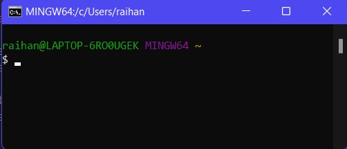
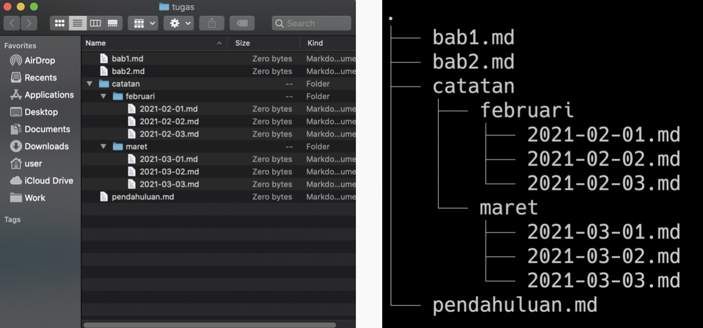
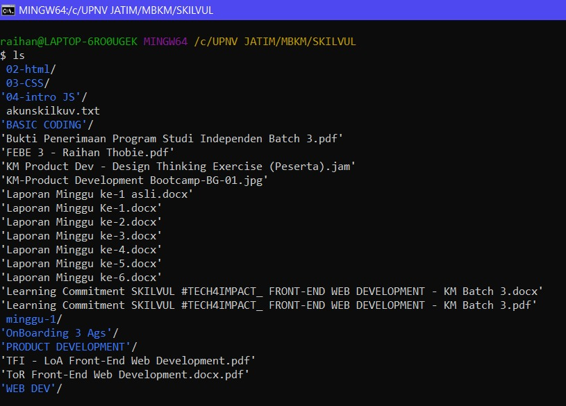
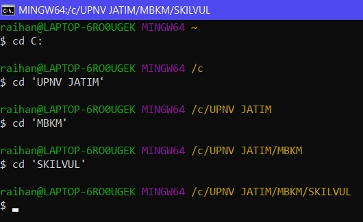
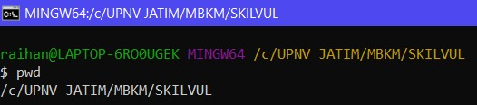

# Writing & Presentation Week-1

## CLI (Command Line Interface)
pada CLI kita bisa mengetikan baris perintah dalam bentuk teks untuk memberikan intruksi kepada komputer untuk melakukan tugas tertentu.

- shell merupakan User Interface yang bertugas untuk memproses semua perintah yang diketik di CLI (dalam terminal).

- Shell membaca dan mengartikan perintah, lalu menginstruksikan sistem operasi untuk menjalankan task sesuai permintaan.

- Dengan kata lain, shell merupakan user interface yang mengelola CLI dan berperan sebagai perantara yang menghubungkan user dan sistem operasi.

> pada windows Shell default nya adalah **CMD / Command Prompt.**

pada gambar dibawah ialah contoh UI dari CLI (shell)


### cara mengakses CLI
 kalian bisa temukan dengan klik logo windows pada layar lalu cari program Command Prompt, atau cara lainnya tekan win + R dan ketik **cmd** pada program run sehingga akan langsung dapat mengakses Command Prompt secara cepat.
<hr>

## FILESYSTEM
untuk mengatur bagaimana data disimpan di dalam sebuah system.

direktori pada filesystem menggunakan struktur yang berbentuk seperti *tree* yang mana pada windows dapat terdiri dari beberapa *tree*

contoh tampilan struktur dari filesystem.


command untuk Navigasi:
- *ls (list)*
command untuk melihat **isi file** yang ada di sebuah directory


command untuk File Manipulation:
- *touch*
command untuk **membuat** sebuah file
    > `touch nama_file`
- *cp (copy)* | *cp -R*
command untuk **menyalin** suatu file dalam suatu directory | untuk **menyalin** directory
    > `cp nama_file | cp -R nama_directory`
- *mv* | *mv -R*
command untuk **memindahkan** file ke directory yang berbeda dan
**mengubah** nama file. | untuk **memindahkan** directory
    > `mv nama_file | mv -R nama_directory`
- *rm* | *rm -R / rm -d*
command untuk **menghapus** suatu file | maupun directory.
    > `rm nama_file | rm -R/-d nama_directory`


command untuk Folder Manipulation:
- *mkdir (make directory)*
command untuk **membuat** sebuah hingga beberapa directory sekaligus

    ```markdown
    mkdir [option] directory_name or path
    ```

- *cd (change directory)*
command untuk **berpindah** directory

- *pwd (Print Working Directory)*
command untuk melihat **current working directory** atau directory kita saat ini


command untuk melihat isi file:
- *head* command untuk melihat beberapa **baris awal** dari suatu file text
- *cat* command untuk melihat **keseluruhan baris** dari suatu file text
- *tail* command untuk melihat beberapa **baris akhir** dari suatu file text
<hr>

## GIT & GITHUB
GIT merupakan tools untuk programmer

GIT sebagai Version Control System
-> **mencatat** setiap **perubahan** pada file (termasuk code yang kita buat) pada suatu proyek baik dikerjakan secara **individu** maupun **tim** (*Source Code Management*)

GIT adalah aplikasi yang dapat melacak setiap perubahan yang terjadi pada suatu folder atau file.

GIT biasanya digunakan oleh para programmer sebagai tempat penyimpanan file program mereka, karena lebih efektif.

file-file yang disimpan menggunakan git akan terlacak seluruh perubahannya, termasuk siapa yang mengubah.(*History*)

GITHUB merupakan layanan *cloud* yang berguna untuk **menyimpan** dan **mengelola** sebuah project yang dinamakan *repository* (repo git). Cara kerja pada GitHub harus terkoneksi pada internet sehingga kita tidak perlu meng-install sebuah software ke dalam perangkat keras. Hal ini memberikan keringanan penyimpanan komputer yang kita gunakan karena file project tersimpan oleh *cloud* GitHub.
<hr>

### kenapa harus menggunakan GIT & GITHUB?
Dengan menggunakan GIT dan Github, kamu akan bisa bekerja dalam sebuat tim. Tujuan besarnya adalah kamu bisa **berkolaborasi** mengerjakan proyek yang sama tanpa harus repot copy paste folder aplikasi yang terupdate.
Kamu juga **tidak perlu menunggu** rekan dalam satu tim kamu menyelesaikan suatu program dahulu untuk berkolaborasi. Kamu bisa membuat file didalam projek yang sama atau membuat code di file yang sama dan menyatukannya saat sudah selesai.

